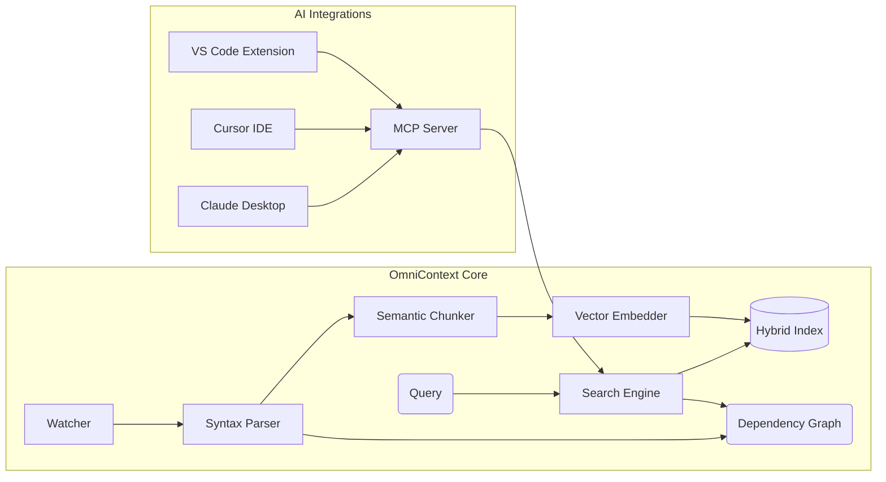

# OmniContext

> A universal, natively-compiled semantic code context engine. Exposes structured codebase abstraction to AI agents through the Model Context Protocol (MCP).

OmniContext is engineered to perform high-speed code parsing, relationship extraction, and semantic embeddings locally, bridging repository structures with large language models seamlessly.

[](https://github.com/steeltroops-ai/omnicontext)
[](https://github.com/steeltroops-ai/omnicontext/releases)
[](https://github.com/steeltroops-ai/omnicontext/actions)
[](https://github.com/steeltroops-ai/omnicontext)
[](./LICENSE)

---

## Architecture Breakdown



1. **Local Execution**: Embeddings (`jina-embeddings-v2-base-code`) and full database indexing execute locally. External cloud APIs are bypassed.
2. **Speed & Recall**: Hybrid retrieval combines sub-millisecond AST boundary keyword matches with HNSW-optimized vector search and graph-boosted reranking.
3. **Language Support**: Robust tree-sitter extraction across 16 languages (Rust, Python, TypeScript, Go, Java, C++, C#, CSS, etc.) and Markdown/TOML/JSON documentation.

---

## Installation (Zero-Config)

Automated deployment logic resolves binaries natively from GitHub release artifacts. Execution auto-downloads the ONNX runtime library, pre-caches the embedding model (~550MB), and injects the MCP server manifest into active AI IDEs.

**Windows (PowerShell)**:

```powershell
irm https://raw.githubusercontent.com/steeltroops-ai/omnicontext/main/distribution/install.ps1 | iex
```

**macOS / Linux (Bash)**:

```bash
curl -fsSL https://raw.githubusercontent.com/steeltroops-ai/omnicontext/main/distribution/install.sh | bash
```

### Package Managers

Alternative lifecycle management via standard package managers:

```powershell
# Windows (Scoop)
scoop bucket add omnicontext https://github.com/steeltroops-ai/omnicontext
scoop install omnicontext

# Windows (WinGet)
winget install omnicontext
```

```bash
# macOS (Homebrew)
brew tap steeltroops-ai/omnicontext
brew install omnicontext

# Cross-platform (Cargo / Pkgx)
cargo binstall omni-cli
pkgx install omnicontext
```

### Uninstallation

To cleanly purge binaries and vector databases:

```powershell
# Windows
irm https://raw.githubusercontent.com/steeltroops-ai/omnicontext/main/distribution/uninstall.ps1 | iex
```

```bash
# macOS / Linux
curl -fsSL https://raw.githubusercontent.com/steeltroops-ai/omnicontext/main/distribution/uninstall.sh | bash
```

---

## Core Usage

Re-initialize standard terminal sessions or source your shell RC (`~/.zshrc` or `~/.bashrc`) before running commands.

```bash
# Verify components
omnicontext --version

# Index target repository (initializes SQLite and vector caches)
omnicontext index .

# Execute direct semantic search
omnicontext search "user authentication flow" --limit 5

# Launch headless daemon process (IPC)
omnicontext-daemon
```

---

## MCP Integrations (Zero-Config)

OmniContext auto-discovers client configurations and writes its `mcp-manifest.json` path into their startup sequences upon install or daemon initialization.

| Client                | Configuration Path           | Protocol Support                   |
| :-------------------- | :--------------------------- | :--------------------------------- |
| **Claude Desktop**    | `claude_desktop_config.json` | Native stdio                       |
| **Cursor**            | `cursor.mcp/config.json`     | Native stdio                       |
| **Windsurf**          | `mcp_config.json`            | Native stdio                       |
| **Cline / RooCode**   | `mcp_settings.json`          | Native stdio                       |
| **Trae IDE**          | `.trae/mcp.json`             | Native stdio                       |
| **Kiro**              | `mcp.json`                   | Native stdio (`powers.mcpServers`) |
| **Continue.dev**      | `config.json`                | Native stdio                       |
| **Antigravity**       | `mcp_config.json`            | Native stdio                       |
| **Claude Code (CLI)** | `~/.claude.json`             | Native stdio                       |

---

## Development & Contribution

OmniContext strictly enforces structural standards, code formatting, and conventional commits. Bypassing formatting or naming standards will block CI chains.

### Local Building

```bash
# Clone source mechanism
git clone https://github.com/steeltroops-ai/omnicontext.git
cd omnicontext

# Build full workspace
cargo build --workspace --release

# Execute CI validation matrices locally
cargo fmt --all -- --check
cargo clippy --workspace -- -D warnings
cargo test --workspace
```

### Commit Protocol

Commit messages must conform strictly to the **Conventional Commits** specification. The `git-cliff` auto-changelog processor relies entirely on these prefixes:

- `feat(scope):` - New features (major version bump if marked with `!`)
- `fix(scope):` - Bug corrections
- `perf(scope):` - Optimizations
- `refactor(scope):` - Structural changes without feature addition
- `docs(scope):` - README or documentation edits
- `chore(release):` - Internal/CI modifications (excluded from changelog)

For detailed formatting constraints and expected boundaries, review `.agents/workflows/commit-conventions.md`.

---

## License

OmniContext tools and base engine components are provided under the terms of the Apache License version 2.0. See [LICENSE](./LICENSE) for full details.
