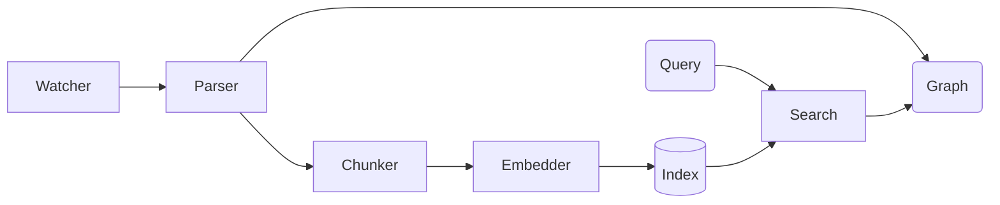

# OmniContext

> A universal, natively-compiled semantic code context engine. Exposes structured codebase abstraction to AI agents through the Model Context Protocol (MCP).

OmniContext is engineered to perform high-speed code parsing, relationship extraction, and semantic embeddings locally, bridging repository structures with large language models seamlessly.

[](https://github.com/steeltroops-ai/omnicontext)
[](https://github.com/steeltroops-ai/omnicontext/releases)
[](https://github.com/steeltroops-ai/omnicontext/actions)
[](https://github.com/steeltroops-ai/omnicontext)
[](https://github.com/steeltroops-ai/omnicontext)
[-blue>)](./LICENSE)

## Tech Stack

[](https://www.rust-lang.org/)
[](https://www.sqlite.org/)
[](https://onnx.ai/)
[](https://modelcontextprotocol.io/)

## Architecture



1. **Locality**: Embeddings and full indexing run locally (`jina-embeddings-v2-base-code`). No external APIs.
2. **Speed**: Sub-millisecond keyword retrieval combined with HNSW-optimized vector search.
3. **Integration**: Full MCP compliance (`omnicontext-mcp`) allows automatic connections to Claude Code, Cursor, Windsurf, or VS Code extensions dynamically.

## Quick Start

For platform-specific deployment, package manager support, and deep-dive integrations, consult the full [**Installation Guide**](INSTALL.md).

```bash
# 1. Directory indexing
omnicontext index /path/to/project

# 2. Semantic query
omnicontext search "user authentication flow" --limit 5

# 3. Model Context Protocol Server (Zero-Config)
omnicontext-mcp --repo /path/to/project
```

## Contributing & Structure

Comprehensive workflow policies, architecture discussions, and codebase conventions are detailed in [**CONTRIBUTING.md**](CONTRIBUTING.md).

Source Code:

- `crates/omni-core`: Internal compilation and search execution.
- `crates/omni-mcp`: Transport layer mapping logic.
- `crates/omni-cli` / `omni-daemon`: Executables for direct user or IDE interaction.

## License

OmniContext relies on an Open-Core model:

- The base engine tools are licensed under [**Apache 2.0**](LICENSE).
- Proprietary scaling functionality operates under a Custom Commercial License.
