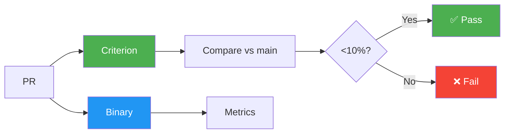

# Benchmark Suite

**Type**: Criterion + Binary | **CI**: Every PR | **Threshold**: 10% regression

Performance regression detection for critical paths.

---

## Quick Start

```bash
# Criterion (5-10 min, statistical)
cargo bench --package omni-core

# Binary (30-60 sec, quick check)
cargo run --release --bin benchmark

# Specific benchmark
cargo bench --package omni-core -- graph_queries
```

---

## Architecture



---

## Targets

| Metric | Target | Status |
|--------|--------|--------|
| File Indexing | >500 files/sec | ✅ |
| Embedding | >800 chunks/sec | ✅ |
| Search P99 | <50ms | ✅ |
| Graph 1-hop | <10ms | ✅ |
| Memory/chunk | <2KB | ✅ |

---

## Benchmark Types

### Criterion (`benches/core_benchmarks.rs`)
- Statistical analysis, HTML reports
- Runs on every PR
- Current: Graph queries (1-3 hops)

### Binary (`src/bin/benchmark.rs`)
- End-to-end testing, console output
- Current: Vector search, SQLite ops, embedding, reranking

---

## Add Benchmark

**Criterion**:
```rust
fn bench_my_feature(c: &mut Criterion) {
    c.bench_function("test", |b| b.iter(|| black_box(my_fn())));
}
criterion_group!(benches, bench_graph_queries, bench_my_feature);
```

**Binary**:
```rust
fn bench_my_feature() -> Result<()> {
    let start = Instant::now();
    // benchmark code
    println!("Duration: {:.2}ms", start.elapsed().as_secs_f64() * 1000.0);
    Ok(())
}
```

---

## CI Regression Detection

1. PR triggers benchmarks (main vs PR)
2. Criterion compares results
3. >10% regression → CI fails
4. PR comment shows targets

---

## Troubleshooting

**Slow**: Use binary for quick checks  
**Noisy**: Close apps, disable CPU scaling  
**CI Fail**: `cargo bench -- --baseline main` locally

---

## See Also

- [Criterion Docs](https://bheisler.github.io/criterion.rs/book/)
- [CI Workflow](../../.github/workflows/benchmark.yml)
