# OmniContext: Universal Code Context Engine

**Product Specification & Architecture Document**  
**Version**: 1.0  
**Date**: 2026-02-28  
**Status**: Design Phase  
**Classification**: Product Design & Technical Architecture

---

## Executive Summary

OmniContext is a **high-performance, locally-runnable code context engine** that gives AI coding agents (Antigravity, VS Code Copilot, Cursor, Claude Code, Windsurf, Codex, Zed AI, etc.) deep understanding of any codebase.

It is **not** an AI assistant. It is the **intelligence infrastructure** that makes AI assistants intelligent.

**The core insight**: Every AI coding agent struggles with the same problem -- they do not understand your codebase. They see files as text, not as an interconnected system. OmniContext solves this by building a live, semantic index of the entire codebase and exposing it via the **Model Context Protocol (MCP)**, making it instantly compatible with every major AI coding tool.

**Business model**: Open-core.

- **Free**: Local MCP server, unlimited repos, full indexing, works offline
- **Pro ($20/mo)**: Multi-repo workspace linking, commit lineage indexing, priority support
- **Enterprise (usage-based)**: Hosted API, team sharing, org-wide knowledge base, audit logs, SSO, SLA

---

## 1. Why This Product Exists

### 1.1 The Problem

Every AI coding agent today is contextually blind:

```
Developer: "Add error handling to the payment service"

What the agent sees:
  - The current file
  - Maybe 2-3 recently opened files
  - Maybe some grep results

What the agent NEEDS:
  - How errors are handled everywhere else in the codebase (patterns)
  - The payment service architecture (which files, which services it calls)
  - The error type hierarchy (AppError enum, HTTP error codes)
  - Recent changes to the payment service (commit history)
  - The team's conventions (result types, logging patterns)
  - Related documentation (API specs, design docs)
```

### 1.2 Existing Solutions and Their Gaps

| Solution       | Approach                    | Limitation                                                       |
| -------------- | --------------------------- | ---------------------------------------------------------------- |
| Augment Code   | Cloud-hosted context engine | Proprietary, expensive, vendor lock-in, code leaves your machine |
| Sourcegraph    | Code search                 | No semantic understanding, no MCP, search-only                   |
| GitHub Copilot | Token-limited context       | 8k-64k token window, no codebase understanding                   |
| Cursor         | Repo-wide indexing          | Tied to Cursor IDE, not portable                                 |
| Codeium        | Context engine              | Closed-source, cloud-dependent                                   |

**OmniContext fills the gap**: Open-source core, runs locally, works with ANY agent via MCP, understands the codebase semantically.

### 1.3 Target Users

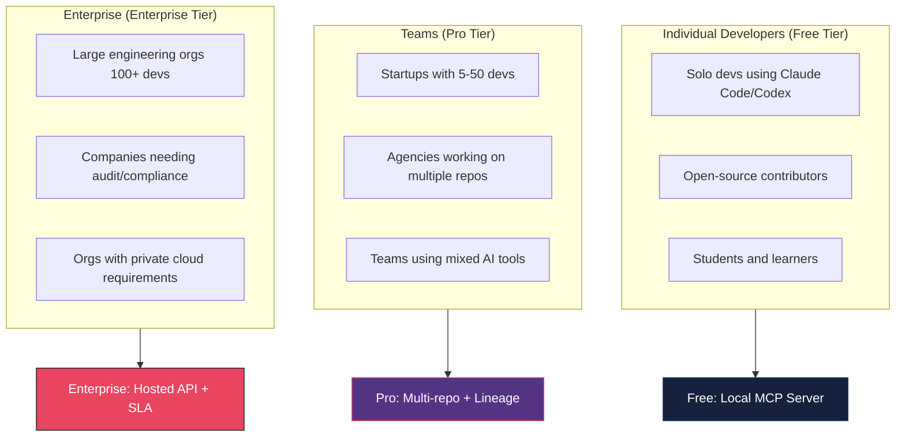

---

## 2. Product Architecture

### 2.1 Delivery Mechanism: Why MCP

We evaluated four delivery mechanisms:

| Mechanism                 | Pros                                                    | Cons                                          | Verdict         |
| ------------------------- | ------------------------------------------------------- | --------------------------------------------- | --------------- |
| **VS Code Extension**     | Rich UI, marketplace distribution                       | Tied to one editor, can't serve CLI agents    | Companion only  |
| **Language Server (LSP)** | Editor-agnostic, well understood                        | Not designed for AI context, limited protocol | Rejected        |
| **MCP Server**            | Universal agent support, standard protocol, local-first | Newer standard, smaller ecosystem             | **Primary**     |
| **REST/gRPC API**         | Maximum flexibility, enterprise-scale                   | Requires hosting, more complex setup          | Enterprise tier |

**Decision**: Ship as an **MCP server** (primary) + **VS Code extension** (companion for configuration/status). Enterprise tier adds a hosted REST/gRPC API.

The MCP server runs locally as a long-lived process. AI agents connect to it via `stdio` transport (for CLI tools like Claude Code) or `SSE/HTTP` transport (for web-based agents).

### 2.2 High-Level Architecture

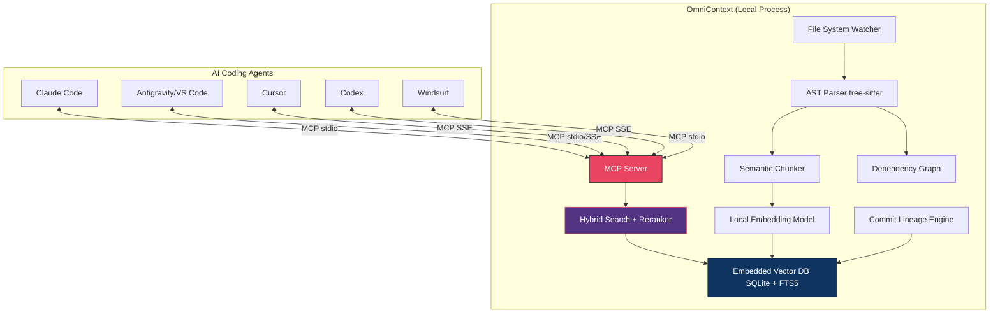

### 2.3 Component Architecture (Detailed)

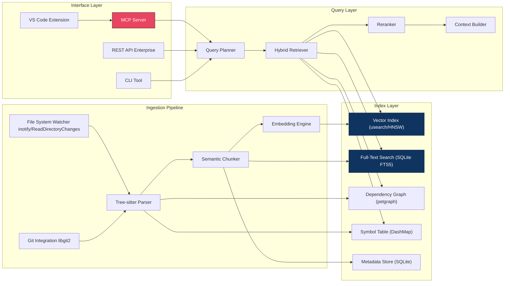

---

## 3. Core Engine Design

### 3.1 Ingestion Pipeline

#### 3.1.1 File System Watcher

```
Platform-native filesystem monitoring:
  Linux:    inotify (via notify crate)
  macOS:    FSEvents (via notify crate)
  Windows:  ReadDirectoryChangesW (via notify crate)

Events monitored:
  - File created / modified / deleted / renamed
  - Directory created / deleted

Debounce: 100ms (batch rapid successive edits)
Exclusions: .git/, node_modules/, target/, __pycache__/, *.lock
Configurable via .omnicontext/config.toml
```

#### 3.1.2 AST Parser (Tree-sitter)

Tree-sitter is the correct choice. It is:

- Incremental (re-parses only changed regions)
- Error-tolerant (produces valid ASTs from broken code)
- Language-agnostic (80+ language grammars available)
- Zero-copy (operates on borrowed byte slices)

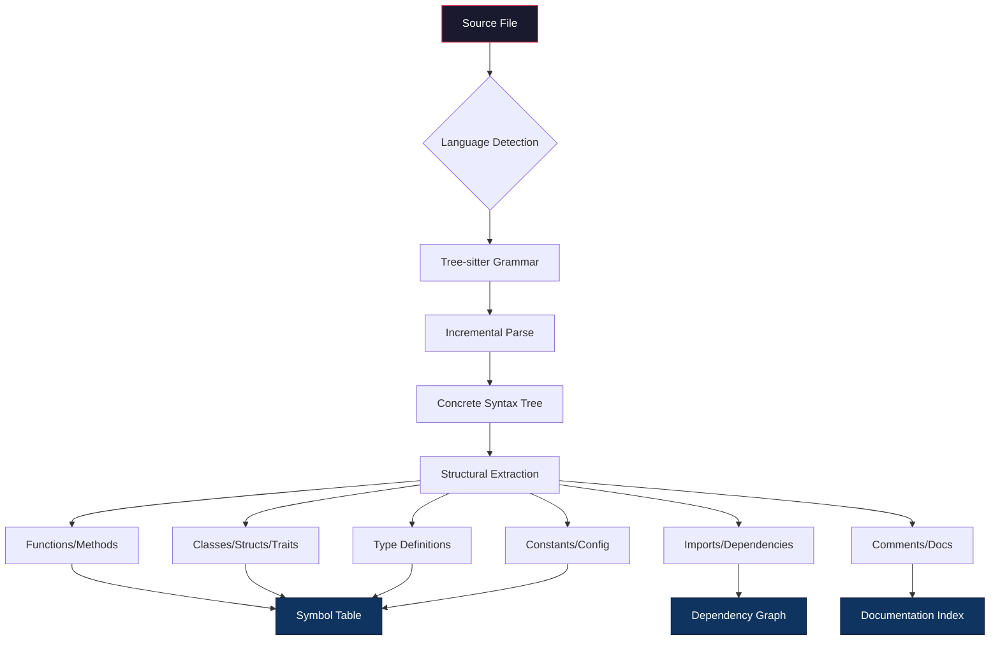

**Structural weights** (not all code is equally important):

| Element                                   | Weight | Rationale                          |
| ----------------------------------------- | ------ | ---------------------------------- |
| Public API / exported function signatures | 1.0    | This is what other code uses       |
| Struct/class definitions with fields      | 0.95   | Core data model                    |
| Trait/interface definitions               | 0.95   | Contracts between components       |
| Error type definitions                    | 0.90   | Error handling patterns            |
| Implementation blocks                     | 0.85   | How things work                    |
| Private functions                         | 0.70   | Internal implementation            |
| Test functions                            | 0.60   | Test coverage and usage patterns   |
| Comments and docs                         | 0.50   | Natural language context           |
| Import statements                         | 0.40   | Dependency info (already in graph) |
| Formatting/whitespace                     | 0.00   | Noise                              |

#### 3.1.3 Semantic Chunker

Code is not text. Chunking strategies that work for prose fail for code. OmniContext uses **AST-aware semantic chunking**:

```
Strategy: Chunk at AST boundaries, never mid-expression

Chunk granularity (in order of preference):
  1. Single function/method (if < 512 tokens)
  2. Single class/struct/impl block (if < 512 tokens)
  3. Logical section of a class (split at method boundaries)
  4. Large function split at block boundaries ({}) as last resort

Chunk metadata attached to every chunk:
  - file_path: relative path from repo root
  - language: programming language
  - symbol_path: fully qualified name (e.g., "crate::module::Struct::method")
  - kind: function | class | struct | trait | impl | const | type | module | test
  - visibility: public | private | crate | protected
  - line_range: (start, end)
  - dependencies: symbols referenced in this chunk
  - doc_comment: extracted doc comment if present
  - git_blame: last author + timestamp (optional, Pro feature)

Context window around chunk:
  - parent_context: class/module name and doc comment
  - sibling_summary: list of other methods/fields in the same scope
  - import_context: relevant imports for this chunk
```

#### 3.1.4 Embedding Engine

Must run locally with zero external dependencies. No API keys, no internet required.

```
Primary model: all-MiniLM-L6-v2 (ONNX, ~80MB)
  - 384 dimensions
  - Optimized for semantic similarity
  - Fast: ~1000 embeddings/sec on modern CPU (no GPU required)
  - ONNX Runtime for cross-platform inference

Alternative models (configurable):
  - nomic-embed-text-v1.5 (768d, better quality, slower)
  - Jina embeddings v3 (1024d, best quality, requires more RAM)
  - Custom model path (bring your own ONNX model)

Embedding pipeline:
  1. Chunk text -> prepend metadata header:
     "[{language}] {symbol_path}: {kind}\n{content}"
  2. Tokenize (model's tokenizer, loaded from ONNX)
  3. Embed (ONNX Runtime inference)
  4. L2-normalize output vector
  5. Store: (chunk_id, vector, metadata) -> SQLite + usearch
```

### 3.2 Index Layer

#### 3.2.1 Storage Architecture

Everything stored in a single directory: `~/.omnicontext/repos/<repo_hash>/`

```
~/.omnicontext/
  config.toml            # Global configuration
  repos/
    a1b2c3d4/            # SHA256(repo_path)[:8]
      index.db           # SQLite database (metadata + FTS)
      vectors.usearch    # HNSW vector index (usearch)
      graph.bincode      # Serialized dependency graph
      symbols.bincode    # Serialized symbol table
      state.json         # Indexing state (last commit, file hashes)
```

**Why SQLite (not PostgreSQL)**: This runs on developer laptops. No daemon, no setup, no port conflicts. SQLite is the correct embedded database:

- Single file, zero configuration
- FTS5 for full-text search with BM25 ranking
- WAL mode for concurrent reads during indexing
- 2TB max database size (more than any codebase needs)

**Why usearch (not pgvector)**: Embedded HNSW index, no external process:

- In-memory HNSW with mmap-backed persistence
- 10x faster than SQLite-based vector search
- Sub-millisecond query latency for <1M vectors
- Written in C++, excellent Rust bindings

#### 3.2.2 Schema

```sql
-- SQLite schema for OmniContext

CREATE TABLE files (
    id          INTEGER PRIMARY KEY,
    path        TEXT NOT NULL UNIQUE,
    language    TEXT NOT NULL,
    hash        TEXT NOT NULL,            -- SHA256 of file content
    size_bytes  INTEGER NOT NULL,
    indexed_at  TEXT NOT NULL DEFAULT (datetime('now')),
    last_modified TEXT NOT NULL
);

CREATE TABLE chunks (
    id          INTEGER PRIMARY KEY,
    file_id     INTEGER NOT NULL REFERENCES files(id) ON DELETE CASCADE,
    symbol_path TEXT NOT NULL,             -- e.g., "crate::auth::middleware::validate_token"
    kind        TEXT NOT NULL,             -- function, struct, trait, impl, const, etc.
    visibility  TEXT NOT NULL DEFAULT 'private',
    line_start  INTEGER NOT NULL,
    line_end    INTEGER NOT NULL,
    content     TEXT NOT NULL,
    doc_comment TEXT,
    metadata    TEXT,                      -- JSON: dependencies, imports, etc.
    vector_id   INTEGER,                  -- Foreign key to usearch index
    token_count INTEGER NOT NULL,
    weight      REAL NOT NULL DEFAULT 1.0  -- Structural importance weight
);

-- FTS5 virtual table for full-text search
CREATE VIRTUAL TABLE chunks_fts USING fts5(
    content,
    doc_comment,
    symbol_path,
    content='chunks',
    content_rowid='id',
    tokenize='porter unicode61 remove_diacritics 2'
);

-- Triggers to keep FTS in sync
CREATE TRIGGER chunks_ai AFTER INSERT ON chunks BEGIN
    INSERT INTO chunks_fts(rowid, content, doc_comment, symbol_path)
    VALUES (new.id, new.content, new.doc_comment, new.symbol_path);
END;

CREATE TRIGGER chunks_ad AFTER DELETE ON chunks BEGIN
    INSERT INTO chunks_fts(chunks_fts, rowid, content, doc_comment, symbol_path)
    VALUES ('delete', old.id, old.content, old.doc_comment, old.symbol_path);
END;

CREATE TRIGGER chunks_au AFTER UPDATE ON chunks BEGIN
    INSERT INTO chunks_fts(chunks_fts, rowid, content, doc_comment, symbol_path)
    VALUES ('delete', old.id, old.content, old.doc_comment, old.symbol_path);
    INSERT INTO chunks_fts(rowid, content, doc_comment, symbol_path)
    VALUES (new.id, new.content, new.doc_comment, new.symbol_path);
END;

CREATE TABLE symbols (
    id          INTEGER PRIMARY KEY,
    name        TEXT NOT NULL,
    fqn         TEXT NOT NULL UNIQUE,     -- Fully qualified name
    kind        TEXT NOT NULL,
    file_id     INTEGER NOT NULL REFERENCES files(id) ON DELETE CASCADE,
    line        INTEGER NOT NULL,
    chunk_id    INTEGER REFERENCES chunks(id)
);

CREATE TABLE dependencies (
    source_id   INTEGER NOT NULL REFERENCES symbols(id),
    target_id   INTEGER NOT NULL REFERENCES symbols(id),
    kind        TEXT NOT NULL,            -- imports, calls, extends, implements, uses_type
    PRIMARY KEY (source_id, target_id, kind)
);

CREATE TABLE commits (
    hash        TEXT PRIMARY KEY,
    message     TEXT NOT NULL,
    author      TEXT NOT NULL,
    timestamp   TEXT NOT NULL,
    summary     TEXT,                     -- LLM-generated summary (Pro feature)
    files_changed TEXT NOT NULL           -- JSON array of file paths
);

-- Indexes
CREATE INDEX idx_chunks_file ON chunks(file_id);
CREATE INDEX idx_chunks_kind ON chunks(kind);
CREATE INDEX idx_chunks_visibility ON chunks(visibility);
CREATE INDEX idx_symbols_name ON symbols(name);
CREATE INDEX idx_symbols_fqn ON symbols(fqn);
CREATE INDEX idx_deps_source ON dependencies(source_id);
CREATE INDEX idx_deps_target ON dependencies(target_id);
```

#### 3.2.3 Dependency Graph

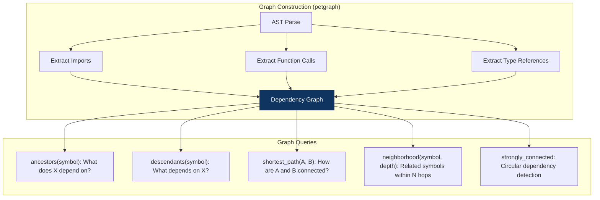

**Edge types**:

```
imports:        File A imports module B
calls:          Function A calls function B
extends:        Class A extends class B
implements:     Struct A implements trait B
uses_type:      Function A uses type B as parameter or return type
instantiates:   Function A creates instance of struct B
field_access:   Function A accesses field of struct B
```

### 3.3 Query Layer

#### 3.3.1 MCP Tools Exposed

The MCP server exposes the following tools to AI agents:

```json
{
  "tools": [
    {
      "name": "search_code",
      "description": "Semantic + keyword search across the codebase. Returns ranked code chunks with context.",
      "inputSchema": {
        "type": "object",
        "properties": {
          "query": {
            "type": "string",
            "description": "Natural language or keyword query"
          },
          "limit": { "type": "integer", "default": 10 },
          "language": { "type": "string", "description": "Filter by language" },
          "kind": {
            "type": "string",
            "enum": ["function", "struct", "trait", "impl", "test", "any"]
          },
          "directory": {
            "type": "string",
            "description": "Limit search to directory subtree"
          }
        },
        "required": ["query"]
      }
    },
    {
      "name": "get_symbol",
      "description": "Get full definition and documentation of a symbol by name or path.",
      "inputSchema": {
        "type": "object",
        "properties": {
          "name": {
            "type": "string",
            "description": "Symbol name or fully qualified path"
          }
        },
        "required": ["name"]
      }
    },
    {
      "name": "get_dependencies",
      "description": "Get what a symbol depends on (imports, calls, type usage).",
      "inputSchema": {
        "type": "object",
        "properties": {
          "symbol": { "type": "string" },
          "depth": {
            "type": "integer",
            "default": 1,
            "description": "How many hops to traverse"
          },
          "direction": {
            "type": "string",
            "enum": ["upstream", "downstream", "both"],
            "default": "both"
          }
        },
        "required": ["symbol"]
      }
    },
    {
      "name": "get_file_summary",
      "description": "Get a structural summary of a file: exports, classes, functions, dependencies.",
      "inputSchema": {
        "type": "object",
        "properties": {
          "path": {
            "type": "string",
            "description": "File path relative to repo root"
          }
        },
        "required": ["path"]
      }
    },
    {
      "name": "find_patterns",
      "description": "Find code patterns and conventions used in the codebase.",
      "inputSchema": {
        "type": "object",
        "properties": {
          "pattern": {
            "type": "string",
            "description": "What pattern to look for, e.g., 'error handling', 'authentication', 'logging'"
          }
        },
        "required": ["pattern"]
      }
    },
    {
      "name": "get_architecture",
      "description": "Get high-level architecture: modules, their relationships, entry points.",
      "inputSchema": {
        "type": "object",
        "properties": {
          "scope": {
            "type": "string",
            "enum": ["full", "module", "directory"],
            "default": "full"
          },
          "path": {
            "type": "string",
            "description": "Scope to specific module or directory"
          }
        }
      }
    },
    {
      "name": "get_recent_changes",
      "description": "Get recent git changes relevant to a topic or file.",
      "inputSchema": {
        "type": "object",
        "properties": {
          "topic": {
            "type": "string",
            "description": "Topic or file to find changes for"
          },
          "days": { "type": "integer", "default": 7 }
        },
        "required": ["topic"]
      }
    },
    {
      "name": "explain_codebase",
      "description": "Get a high-level explanation of what this codebase does, its tech stack, and structure.",
      "inputSchema": {
        "type": "object",
        "properties": {}
      }
    }
  ]
}
```

#### 3.3.2 Hybrid Search Engine

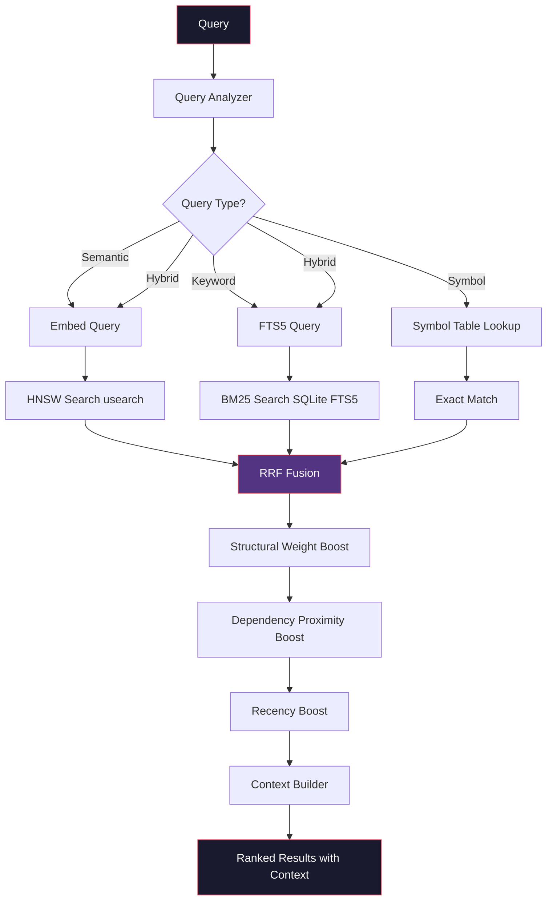

**Scoring formula**:

```
final_score(chunk) =
    rrf_score(semantic_rank, keyword_rank)
    * structural_weight(chunk.kind, chunk.visibility)
    * dependency_proximity(chunk, query_context)
    * recency_boost(chunk.last_modified)

where:
    rrf_score = 1/(k + rank_semantic) + 1/(k + rank_keyword),  k=60
    structural_weight = weight from AST importance table (0.4 to 1.0)
    dependency_proximity = 1.0 + 0.2 * is_dependency_of_current_file
    recency_boost = 1.0 + 0.1 * (1 - days_since_modified / 365)
```

#### 3.3.3 Context Builder

After retrieval, the context builder assembles a rich context response:

```
For each retrieved chunk, include:
  1. The chunk content itself
  2. Parent context (class name, module doc)
  3. Sibling summary (other methods in same class)
  4. Import context (what this chunk depends on)
  5. Usage examples (if chunk is a function, show callers)
  6. Related documentation (if doc comments reference other symbols)

Token budget management:
  - Default: 4000 tokens per response
  - Configurable per-tool invocation
  - MMR diversity: avoid redundant results from same file/module
```

---

## 4. Technology Stack

### 4.1 Language: Rust

Non-negotiable. The engine runs on developer machines alongside their IDE. It must be:

- Fast (sub-second indexing of file changes)
- Memory-efficient (< 200MB RSS for a 100k-file monorepo)
- Single binary (no runtime dependencies, no JVM, no Python venv)
- Cross-platform (Linux, macOS, Windows)

### 4.2 Dependency Stack

| Component     | Crate/Library        | Purpose                           |
| ------------- | -------------------- | --------------------------------- |
| Async runtime | `tokio`              | Event loop, concurrent IO         |
| MCP protocol  | `rmcp` or custom     | MCP server implementation         |
| AST parsing   | `tree-sitter`        | Incremental code parsing          |
| Embedding     | `ort` (ONNX Runtime) | Local model inference             |
| Vector index  | `usearch`            | HNSW approximate nearest neighbor |
| Database      | `rusqlite`           | Embedded SQLite with FTS5         |
| File watching | `notify`             | Cross-platform filesystem events  |
| Git           | `gix` (gitoxide)     | Pure-Rust git implementation      |
| HTTP server   | `axum`               | REST API (enterprise tier)        |
| Serialization | `serde` + `bincode`  | Fast binary serialization         |
| CLI           | `clap`               | Command-line interface            |
| Logging       | `tracing`            | Structured logging                |
| Config        | `toml`               | Configuration file parsing        |
| Graph         | `petgraph`           | Dependency graph operations       |
| Concurrency   | `dashmap`            | Lock-free concurrent HashMap      |

### 4.3 Repository Structure

```
omnicontext/
  Cargo.toml                  # Workspace root
  crates/
    omni-core/                # Core indexing engine
      src/
        parser/               # Tree-sitter AST parsing
        chunker/              # Semantic code chunking
        embedder/             # ONNX embedding inference
        index/                # Vector + FTS index management
        graph/                # Dependency graph
        search/               # Hybrid retrieval + ranking
    omni-mcp/                 # MCP server implementation
      src/
        server.rs             # MCP protocol handler
        tools.rs              # Tool definitions
        transport.rs          # stdio + SSE transports
    omni-cli/                 # CLI interface
      src/
        main.rs               # CLI entry point
        commands/              # index, search, status, config
    omni-vscode/              # VS Code extension (TypeScript)
      src/
        extension.ts          # Extension entry point
        statusbar.ts          # Status bar indicators
        commands.ts           # Extension commands
    omni-api/                 # REST API (enterprise)
      src/
        routes/               # HTTP endpoints
        auth/                 # API key + JWT auth
        billing/              # Usage metering
  models/                     # ONNX model files
  config/                     # Default configuration
  tests/
    fixtures/                 # Test repositories
    integration/              # Integration tests
```

---

## 5. MCP Protocol Implementation

### 5.1 Transport Layers

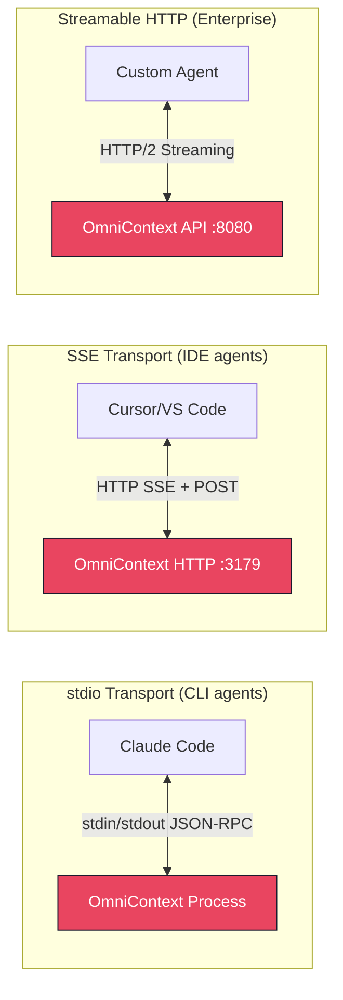

### 5.2 Agent Configuration Examples

**Claude Code** (`~/.claude/mcp_servers.json`):

```json
{
  "omnicontext": {
    "command": "omnicontext",
    "args": ["mcp", "--repo", "/path/to/project"],
    "transport": "stdio"
  }
}
```

**VS Code / Antigravity** (`.vscode/settings.json`):

```json
{
  "mcp.servers": {
    "omnicontext": {
      "command": "omnicontext",
      "args": ["mcp", "--repo", "${workspaceFolder}"],
      "transport": "stdio"
    }
  }
}
```

**Cursor** (MCP settings):

```json
{
  "omnicontext": {
    "url": "http://localhost:3179/mcp",
    "transport": "sse"
  }
}
```

---

## 6. Performance Requirements

### 6.1 Targets

| Operation                            | Target      | Strategy                             |
| ------------------------------------ | ----------- | ------------------------------------ |
| Initial full index (10k files)       | <60 seconds | Parallel parsing, batched embeddings |
| Initial full index (100k files)      | <10 minutes | Same, with progress reporting        |
| Incremental re-index (1 file change) | <200ms      | Tree-sitter incremental parse        |
| Semantic search (query)              | <50ms       | usearch HNSW + SQLite FTS5           |
| Symbol lookup                        | <5ms        | DashMap in-memory lookup             |
| Dependency graph query               | <10ms       | petgraph in-memory traversal         |
| Memory usage (10k file repo)         | <100MB      | mmap-backed vector index             |
| Memory usage (100k file repo)        | <500MB      | Chunk eviction for cold files        |
| Binary size                          | <50MB       | Static linking, no debug symbols     |
| Startup time (warm index exists)     | <2s         | mmap vector index, lazy load graph   |

### 6.2 Latency Budget

```mermaid
gantt
    title Search Query Latency Budget (P99)
    dateFormat X
    axisFormat %L ms
    section Query Processing
    Parse + analyze query : 0, 2
    Embed query (ONNX) : 2, 12
    section Retrieval
    HNSW vector search : 12, 18
    FTS5 keyword search : 12, 16
    section Ranking
    RRF fusion + boosting : 18, 22
    section Context
    Context builder : 22, 35
    section Response
    Serialize MCP response : 35, 37
    section Total
    End-to-end : 0, 37
```

---

## 7. Business Model

### 7.1 Tier Structure

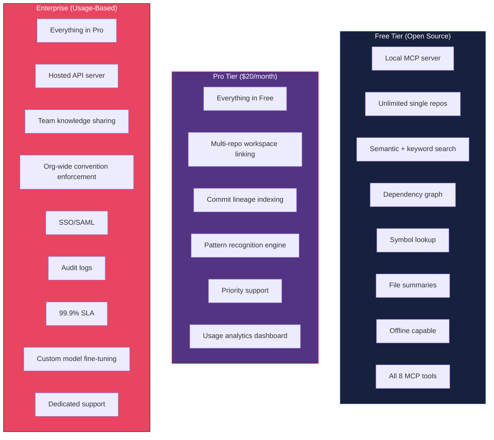

### 7.2 Revenue Streams

| Stream              | Model                                               | Target                                     |
| ------------------- | --------------------------------------------------- | ------------------------------------------ |
| Pro subscriptions   | $20/month per seat                                  | Individual developers, small teams         |
| Enterprise API      | Usage-based (per query, per indexed file)           | Engineering orgs 100+ devs                 |
| Custom deployment   | Annual contract + professional services             | Regulated industries, on-prem requirements |
| Marketplace plugins | 30% rev share on community-built language analyzers | Extension ecosystem                        |

### 7.3 Open-Source Strategy

The **core engine** is Apache 2.0 licensed:

- Ingestion pipeline (parser, chunker, embedder)
- Index layer (SQLite, usearch, dependency graph)
- Query layer (hybrid search, ranking, context builder)
- MCP server (all 8 tools)
- CLI

**Pro/Enterprise features** are source-available (BSL or proprietary):

- Multi-repo workspace linking
- Commit lineage with LLM summarization
- Hosted API infrastructure
- Team knowledge sharing
- Analytics and usage dashboards

---

## 8. Supported Languages (Priority Order)

### 8.1 Launch Languages

| Priority | Language              | Grammar                | Ecosystem Share     |
| -------- | --------------------- | ---------------------- | ------------------- |
| 1        | Python                | tree-sitter-python     | ~30%                |
| 2        | TypeScript/JavaScript | tree-sitter-typescript | ~25%                |
| 3        | Rust                  | tree-sitter-rust       | ~5% (our ecosystem) |
| 4        | Go                    | tree-sitter-go         | ~10%                |
| 5        | Java                  | tree-sitter-java       | ~15%                |

### 8.2 Phase 2 Languages

| Language | Grammar                        | Target Quarter |
| -------- | ------------------------------ | -------------- |
| C/C++    | tree-sitter-c, tree-sitter-cpp | Q2             |
| C#       | tree-sitter-c-sharp            | Q2             |
| Ruby     | tree-sitter-ruby               | Q3             |
| PHP      | tree-sitter-php                | Q3             |
| Swift    | tree-sitter-swift              | Q3             |
| Kotlin   | tree-sitter-kotlin             | Q3             |

### 8.3 Adding a New Language

Adding a language requires:

1. Tree-sitter grammar (usually already exists)
2. Structural extractor (map AST nodes to our chunk kinds)
3. Import resolver (how does this language handle dependencies)
4. Test fixture (reference repo for integration tests)

Estimated effort per language: 2-3 days of engineering.

---

## 9. Distribution

### 9.1 Installation Methods

```
# Cargo (Rust developers)
cargo install omnicontext

# Homebrew (macOS/Linux)
brew install omnicontext

# AUR (Arch Linux)
yay -S omnicontext

# Scoop (Windows)
scoop install omnicontext

# Direct download (all platforms)
curl -fsSL https://omnicontext.dev/install.sh | sh

# Docker (enterprise/CI)
docker run -v /path/to/repo:/repo omnicontext/server
```

### 9.2 VS Code Extension Distribution

Published on VS Code Marketplace and Open VSX Registry:

- Handles OmniContext process lifecycle (start/stop)
- Shows indexing progress in status bar
- Configuration UI for .omnicontext/config.toml
- One-click "Index this workspace"

---

## 10. Competitive Analysis

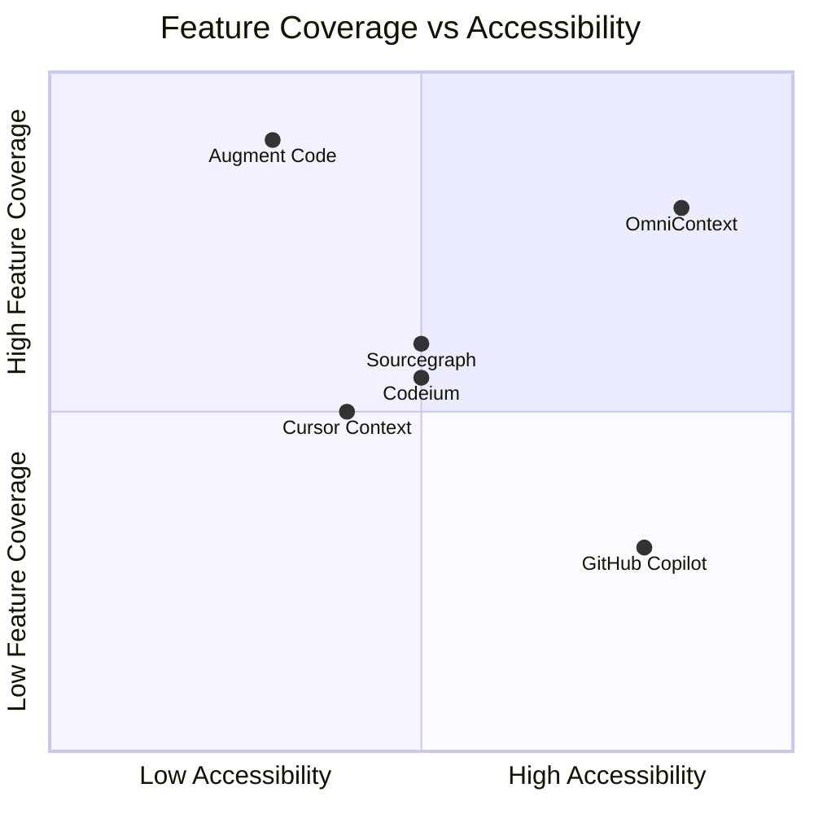

| Feature               | OmniContext        | Augment Code | Cursor      | GitHub Copilot |
| --------------------- | ------------------ | ------------ | ----------- | -------------- |
| Runs locally          | Yes                | No (cloud)   | Partial     | No             |
| Open source core      | Yes (Apache 2.0)   | No           | No          | No             |
| MCP support           | Native             | Via adapter  | Partial     | No             |
| Works with any agent  | Yes (MCP standard) | Augment only | Cursor only | VS Code only   |
| Offline capable       | Yes                | No           | No          | No             |
| Code stays on machine | Yes                | No           | Partial     | No             |
| Dependency graph      | Yes                | Partial      | No          | No             |
| 100k+ file repos      | Yes (<10min index) | Yes          | Slow        | No             |
| Custom model support  | Yes (ONNX)         | No           | No          | No             |
| Cost (individual)     | Free               | $50+/mo      | $20/mo      | $10/mo         |

---

## 11. Implementation Roadmap

### 11.1 Phase Overview

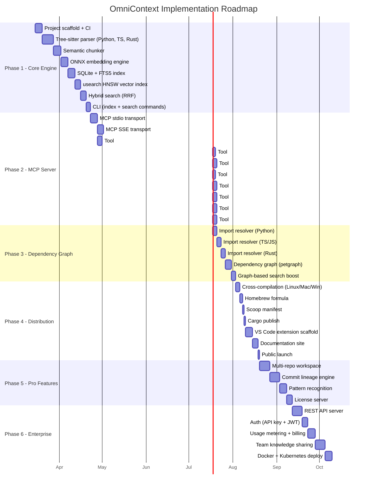

### 11.2 Phase 1 Deliverables (Detail)

| Task               | Days | Output                                               | Acceptance                                            |
| ------------------ | ---- | ---------------------------------------------------- | ----------------------------------------------------- |
| Project scaffold   | 5    | Cargo workspace, CI, config                          | `cargo build` green                                   |
| Tree-sitter parser | 8    | Parse Python, TS, Rust to AST                        | Extract all functions/classes from test repos         |
| Semantic chunker   | 5    | AST-aware chunking                                   | 10k-file repo chunks correctly, <512 tokens per chunk |
| ONNX embedder      | 5    | all-MiniLM-L6-v2 inference                           | 1000 embeddings/sec on CPU                            |
| SQLite + FTS5      | 5    | Chunk storage + text search                          | BM25 search returns relevant results                  |
| usearch HNSW       | 4    | Vector index                                         | Semantic search <50ms, recall@10 >0.9                 |
| Hybrid search      | 4    | RRF fusion + ranking                                 | Hybrid beats either signal alone                      |
| CLI                | 3    | `omnicontext index .` + `omnicontext search "query"` | End-to-end demo works                                 |

**Phase 1 total**: ~39 days of focused engineering.

---

## 12. Security and Privacy

### 12.1 Privacy Guarantees

```
Free/Pro tier:
  - ALL processing happens locally
  - NO code ever leaves the developer's machine
  - NO telemetry on code content
  - Optional anonymous usage stats (opt-in): query count, language distribution
  - Model inference is local (ONNX, no API calls)

Enterprise tier (hosted):
  - Code processed in isolated tenant containers
  - Encrypted at rest (AES-256) and in transit (TLS 1.3)
  - SOC2 compliance target
  - Data residency options (US-East, EU-West, APAC)
  - Customer-managed encryption keys (CMEK)
  - 90-day data retention, auto-purge on account deletion
```

### 12.2 Threat Model

| Threat               | Mitigation                                            |
| -------------------- | ----------------------------------------------------- |
| Code exfiltration    | Local processing, no network calls in free/pro        |
| Index tampering      | SQLite WAL mode, file permission checks               |
| Malicious MCP client | Connection authentication, tool-level access control  |
| Supply chain         | Pinned dependencies, vendored tree-sitter grammars    |
| Model extraction     | ONNX model is open (all-MiniLM is public), no IP risk |

---

## 13. Success Metrics

### 13.1 Product Metrics

| Metric                                  | Target (6 months post-launch) |
| --------------------------------------- | ----------------------------- |
| GitHub stars                            | 5,000+                        |
| Monthly active users (free)             | 10,000+                       |
| Pro subscribers                         | 500+                          |
| Enterprise customers                    | 5+                            |
| MRR                                     | $15,000+                      |
| NPS                                     | >50                           |
| Average indexing time (10k files)       | <60s                          |
| Search P99 latency                      | <50ms                         |
| Weekly active tool invocations per user | >100                          |

### 13.2 Technical KPIs

| KPI                                                   | Target             |
| ----------------------------------------------------- | ------------------ |
| Search relevance (NDCG@10 on internal benchmark)      | >0.75              |
| Index coverage (% of code chunks successfully parsed) | >98%               |
| Incremental update latency                            | <200ms             |
| Memory per 10k files                                  | <100MB             |
| Crash rate                                            | <0.01% of sessions |

---

**Document Status**: Design specification -- ready for implementation  
**Owner**: Mayank  
**Last Updated**: 2026-02-28  
**License**: Document is proprietary. Product core is Apache 2.0.
