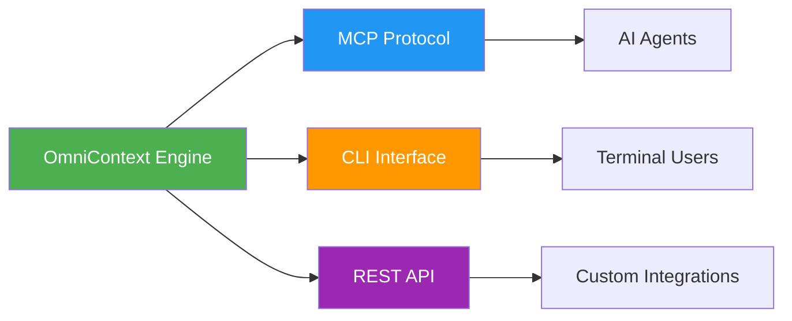
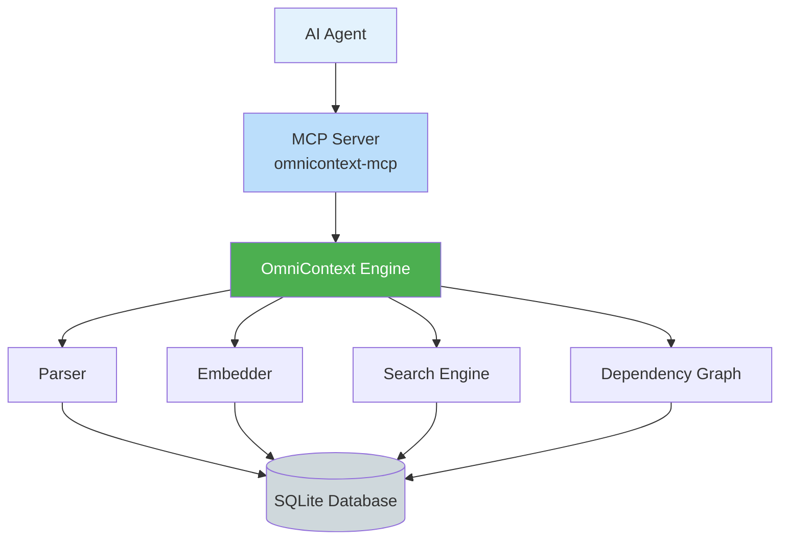
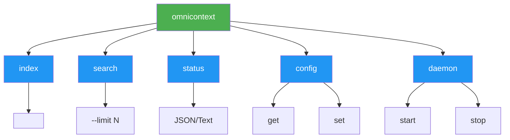

# API Reference

**Version**: v0.14.0  
**Last Updated**: March 2026

Complete API documentation for OmniContext, including MCP tools, CLI commands, and integration patterns.

---

## Overview

OmniContext provides three primary integration interfaces:



---

## Model Context Protocol (MCP)

The MCP interface enables AI agents to access OmniContext capabilities through a standardized protocol.

### Architecture



### Available Tools

| Tool | Purpose | Complexity |
|------|---------|------------|
| `search_codebase` | Hybrid semantic + keyword search | O(log N) |
| `get_architectural_context` | Dependency graph traversal | O(V + E) |
| `get_dependencies` | Symbol dependency analysis | O(V + E) |
| `get_commit_context` | Git history retrieval | O(N) |
| `get_workspace_stats` | Repository statistics | O(1) |
| `context_window` | Token-optimized context assembly | O(log N) |

**[→ Complete MCP Tools Documentation](./mcp-tools.md)**

### Integration Example

```json
{
  "mcpServers": {
    "omnicontext": {
      "command": "omnicontext-mcp",
      "args": [],
      "env": {}
    }
  }
}
```

**Supported Clients**:
- Claude Desktop
- Cursor
- Windsurf
- Kiro
- Continue.dev
- Cline / RooCode

---

## Command-Line Interface

The CLI provides direct access to OmniContext functionality for terminal users and automation scripts.

### Command Structure



### Core Commands

#### `omnicontext index <path>`

Indexes a repository for semantic search.

**Parameters**:
- `<path>` - Repository path (default: current directory)

**Options**:
- `--force` - Force re-indexing of all files
- `--watch` - Watch for file changes and auto-index

**Example**:
```bash
omnicontext index /path/to/project
omnicontext index . --watch
```

**Output**:
- Files indexed count
- Chunks created count
- Embeddings generated count
- Indexing duration

---

#### `omnicontext search <query>`

Searches indexed codebase.

**Parameters**:
- `<query>` - Search query (natural language or keywords)

**Options**:
- `--limit <N>` - Maximum results (default: 10)
- `--format <json|text>` - Output format (default: text)

**Example**:
```bash
omnicontext search "authentication middleware" --limit 5
omnicontext search "JWT validation" --format json
```

**Output**:
- Ranked search results
- File paths and line numbers
- Relevance scores
- Code snippets

---

#### `omnicontext status`

Displays repository indexing status.

**Options**:
- `--format <json|text>` - Output format (default: text)

**Example**:
```bash
omnicontext status
omnicontext status --format json
```

**Output**:
- Files indexed
- Chunks created
- Embeddings coverage
- Index size
- Last indexed timestamp

---

#### `omnicontext config`

Manages configuration settings.

**Subcommands**:
- `get <key>` - Retrieve configuration value
- `set <key> <value>` - Set configuration value
- `list` - List all configuration

**Example**:
```bash
omnicontext config get embedding.model
omnicontext config set search.limit 20
omnicontext config list
```

---

#### `omnicontext-daemon`

Starts the background daemon for MCP integration.

**Options**:
- `--port <N>` - Server port (default: 3000)
- `--log-level <level>` - Logging level (default: info)

**Example**:
```bash
omnicontext-daemon
omnicontext-daemon --port 3001 --log-level debug
```

---

## REST API (Enterprise)

The REST API provides HTTP access to OmniContext functionality for custom integrations.

### Endpoints

```mermaid
graph LR
    A[REST API] --> B[/api/v1/search]
    A --> C[/api/v1/index]
    A --> D[/api/v1/status]
    A --> E[/api/v1/graph]
    
    style A fill:#4CAF50,color:#fff
    style B fill:#2196F3,color:#fff
    style C fill:#2196F3,color:#fff
    style D fill:#2196F3,color:#fff
    style E fill:#2196F3,color:#fff
```

**Base URL**: `http://localhost:3000/api/v1`

### POST /search

Search indexed codebase.

**Request**:
```json
{
  "query": "authentication middleware",
  "limit": 10
}
```

**Response**:
```json
{
  "results": [
    {
      "file": "src/auth/middleware.rs",
      "line_start": 45,
      "line_end": 67,
      "score": 0.92,
      "content": "..."
    }
  ],
  "total": 15,
  "duration_ms": 23
}
```

---

## Error Handling

All APIs use consistent error codes and formats.

### Error Response Format

```json
{
  "error": {
    "code": -32000,
    "message": "Index not initialized",
    "data": {
      "suggestion": "Run 'omnicontext index .' first"
    }
  }
}
```

### Error Codes

| Code | Description | Resolution |
|------|-------------|------------|
| -32000 | Internal error | Check logs, retry operation |
| -32001 | Server overloaded | Reduce request rate |
| -32602 | Invalid parameters | Check parameter types and values |
| -32603 | Internal JSON-RPC error | Report bug with details |

---

## Rate Limiting

The daemon implements backpressure handling to prevent overload.

**Limits**:
- Maximum concurrent requests: 100
- Requests exceeding limit: Rejected with 503 status

**Headers**:
- `X-RateLimit-Limit`: Maximum requests
- `X-RateLimit-Remaining`: Remaining requests
- `X-RateLimit-Reset`: Reset timestamp

---

## Authentication (Enterprise)

Enterprise deployments support authentication and authorization.

### API Key Authentication

```bash
curl -H "Authorization: Bearer YOUR_API_KEY" \
  http://localhost:3000/api/v1/search
```

### OAuth 2.0 (Coming Soon)

Support for OAuth 2.0 authentication for enterprise SSO integration.

---

## SDK Support

Official SDKs for popular languages:

- **TypeScript/JavaScript**: `@omnicontext/sdk`
- **Python**: `omnicontext-sdk`
- **Rust**: `omnicontext` (native)

**Example (TypeScript)**:
```typescript
import { OmniContext } from '@omnicontext/sdk';

const client = new OmniContext();
const results = await client.search('authentication', { limit: 5 });
```

---

## Performance Characteristics

| Operation | Latency (P99) | Throughput |
|-----------|---------------|------------|
| Search | <50ms | 1000 req/s |
| Index (per file) | <2ms | 500 files/s |
| Graph query (1-hop) | <10ms | 5000 req/s |
| Embedding | <1.5ms/chunk | 800 chunks/s |

---

## See Also

- **[MCP Tools](./mcp-tools.md)** - Detailed MCP tool documentation
- **[Architecture](../architecture/intelligence.md)** - System architecture
- **[Contributing](../contributing/overview.md)** - API development guide

---

## Implementation References

- **MCP Server**: `crates/omni-mcp/src/tools.rs`
- **CLI**: `crates/omni-cli/src/main.rs`
- **REST API**: `crates/omni-core/src/server.rs`
