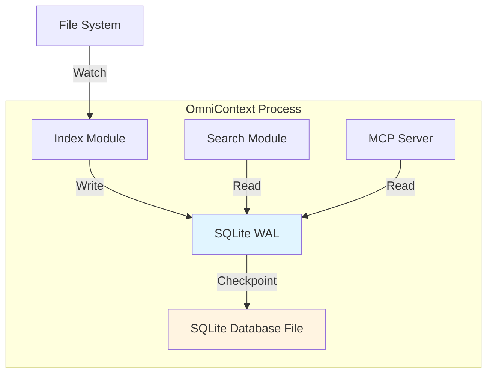
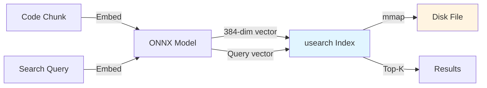
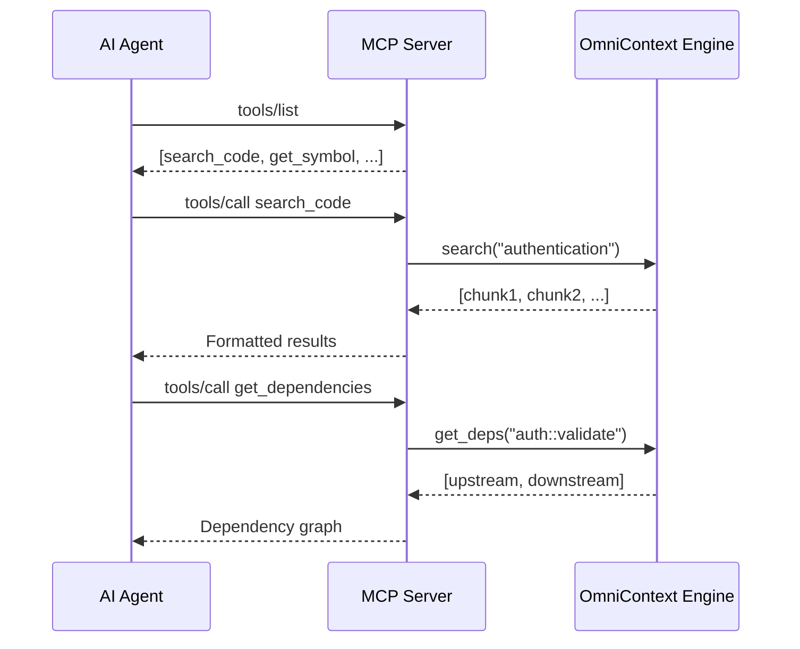
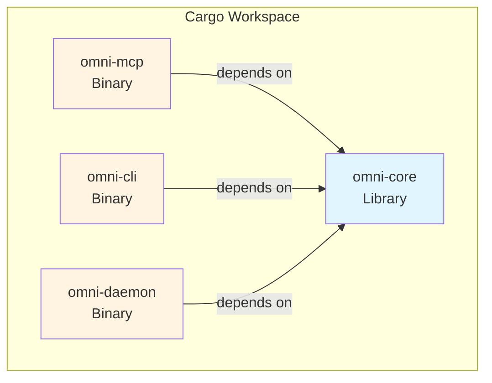
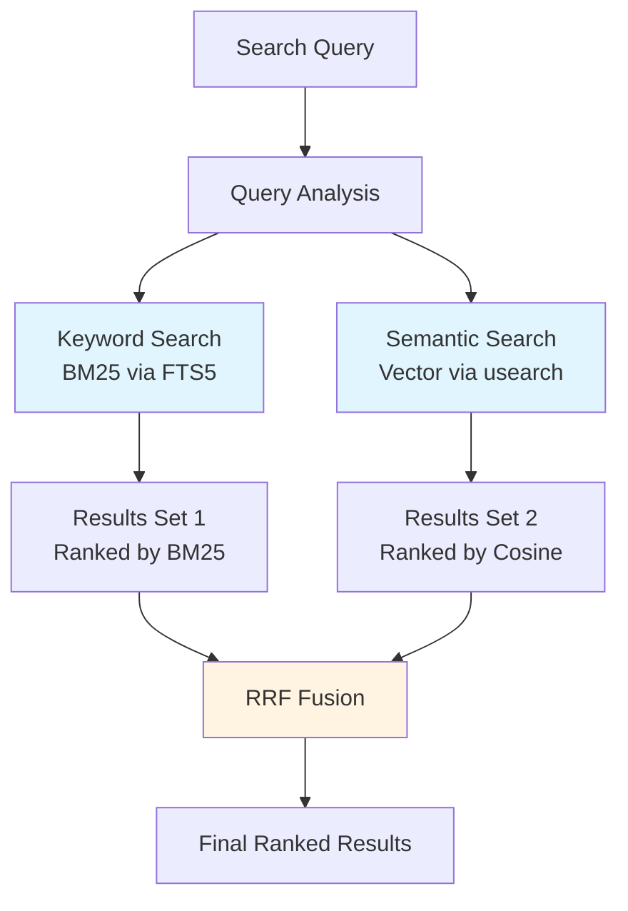
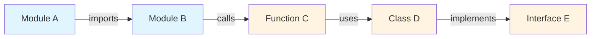

# Architecture Decision Records

> **Last Updated**: 2026-03-01  
> **Status**: Living Document

This document captures significant architectural decisions made during the development of OmniContext, including context, rationale, alternatives considered, and consequences.

## Table of Contents

- [ADR-001: Rust as Primary Language](#adr-001-rust-as-primary-language)
- [ADR-002: SQLite for Metadata Storage](#adr-002-sqlite-for-metadata-storage)
- [ADR-003: usearch for Vector Index](#adr-003-usearch-for-vector-index)
- [ADR-004: Code-Specific Embedding Model](#adr-004-code-specific-embedding-model)
- [ADR-005: MCP as Primary Interface](#adr-005-mcp-as-primary-interface)
- [ADR-006: Monorepo Workspace Structure](#adr-006-monorepo-workspace-structure)
- [ADR-007: Hybrid Search Architecture](#adr-007-hybrid-search-architecture)
- [ADR-008: Dependency Graph with petgraph](#adr-008-dependency-graph-with-petgraph)

---

## ADR-001: Rust as Primary Language

**Status**: ✅ Accepted  
**Date**: 2026-02-28  
**Deciders**: Core Team

### Context

OmniContext runs as a local daemon on developer machines, processing large codebases with real-time indexing and search requirements. The system must be:
- Fast (sub-50ms search latency)
- Memory-efficient (<100MB for 10k files)
- Reliable (no crashes, memory leaks)
- Portable (single binary, no runtime dependencies)

### Decision

Use **Rust (2021 edition, stable toolchain)** for all backend components.

### Alternatives Considered

| Language   | Pros | Cons | Verdict |
|------------|------|------|---------|
| **Go** | Fast compilation, simple concurrency | GC pauses, larger binaries, no zero-cost abstractions | ❌ Rejected |
| **C++** | Maximum performance, mature ecosystem | Memory safety issues, complex build system | ❌ Rejected |
| **Python** | Rapid development, ML ecosystem | Slow, requires runtime, GIL limitations | ❌ Rejected |
| **Rust** | Memory safety, zero-cost abstractions, single binary | Steep learning curve, slower iteration | ✅ **Selected** |

### Consequences

#### Positive
- **Zero-cost abstractions**: Predictable performance without runtime overhead
- **Memory safety**: No segfaults, data races, or memory leaks
- **Single static binary**: No JVM/Python/Node runtime required
- **Excellent async ecosystem**: tokio provides production-grade async runtime
- **Native FFI**: tree-sitter C bindings integrate naturally
- **Cargo ecosystem**: Robust dependency management and tooling

#### Negative
- **Slower iteration**: Longer compile times compared to interpreted languages
- **Steeper learning curve**: Borrow checker and lifetime annotations
- **Smaller talent pool**: Fewer Rust developers than Go/Python

#### Mitigations
- Use `cargo check` for fast feedback during development
- Provide comprehensive documentation and examples
- Leverage Rust's strong type system to catch bugs at compile time

---

## ADR-002: SQLite for Metadata Storage

**Status**: ✅ Accepted  
**Date**: 2026-02-28  
**Deciders**: Core Team

### Context

We need a relational database for:
- File metadata (paths, hashes, timestamps)
- Code chunks (content, line numbers, kind)
- Symbols (names, fully qualified names, visibility)
- Full-text search (FTS5 for keyword search)

Requirements:
- Embedded (no separate process)
- ACID transactions
- Full-text search support
- Concurrent reads during writes

### Decision

Use **embedded SQLite** via `rusqlite` with `bundled` feature and WAL mode.

### Architecture



### Alternatives Considered

| Database | Pros | Cons | Verdict |
|----------|------|------|---------|
| **PostgreSQL** | Advanced features, better concurrency | Requires separate process, port conflicts | ❌ Rejected |
| **RocksDB** | High write throughput | No SQL, no FTS, complex API | ❌ Rejected |
| **Sled** | Pure Rust, embedded | Immature, no SQL, no FTS | ❌ Rejected |
| **SQLite** | Embedded, FTS5, WAL mode, zero-config | Single writer limitation | ✅ **Selected** |

### Consequences

#### Positive
- **Zero configuration**: Single file, no setup required
- **FTS5 support**: Built-in full-text search with BM25 ranking
- **WAL mode**: Non-blocking reads during writes
- **Portable**: Index directory can be moved/copied
- **ACID transactions**: Data integrity guaranteed
- **Small footprint**: ~1MB library size

#### Negative
- **Write concurrency**: Only one writer at a time
- **No replication**: Single-node only
- **Limited scalability**: Not suitable for >1M files

#### Mitigations
- Use WAL mode for concurrent reads
- Batch writes in transactions (1000+ inserts per transaction)
- For enterprise tier (>100k files), consider PostgreSQL with REST API

### Schema Design

```sql
-- Files table
CREATE TABLE files (
    id INTEGER PRIMARY KEY,
    path TEXT UNIQUE NOT NULL,
    hash TEXT NOT NULL,
    indexed_at INTEGER NOT NULL
);

-- Chunks table with FTS5
CREATE VIRTUAL TABLE chunks_fts USING fts5(
    content,
    file_id UNINDEXED,
    chunk_id UNINDEXED
);

-- Symbols table
CREATE TABLE symbols (
    id INTEGER PRIMARY KEY,
    name TEXT NOT NULL,
    fqn TEXT UNIQUE NOT NULL,
    kind TEXT NOT NULL,
    file_id INTEGER REFERENCES files(id)
);
```

---

## ADR-003: usearch for Vector Index

**Status**: ✅ Accepted  
**Date**: 2026-02-28  
**Deciders**: Core Team

### Context

We need approximate nearest neighbor (ANN) search for semantic code retrieval. Requirements:
- Embedded (no external process)
- Sub-millisecond query latency
- Memory-efficient (mmap support)
- Support for 100k+ vectors

### Decision

Use **usearch** (HNSW algorithm) with mmap-backed persistence.

### Architecture



### Alternatives Considered

| Solution | Pros | Cons | Verdict |
|----------|------|------|---------|
| **Qdrant** | Feature-rich, filtering | Separate process, heavier | ❌ Rejected |
| **Milvus** | Enterprise features | Complex setup, overkill | ❌ Rejected |
| **FAISS** | Battle-tested, fast | C++ dependency, no mmap | ❌ Rejected |
| **usearch** | Embedded, mmap, fast | Less mature, no filtering | ✅ **Selected** |

### Consequences

#### Positive
- **Embedded**: No separate process or port conflicts
- **mmap-backed**: Vectors don't consume RSS until accessed
- **Fast queries**: Sub-millisecond for <1M vectors
- **Small footprint**: Minimal binary size increase
- **HNSW algorithm**: State-of-the-art ANN performance

#### Negative
- **No built-in filtering**: Must post-filter results
- **No in-place updates**: Must delete + re-insert
- **Less mature**: Smaller ecosystem than Qdrant/FAISS

#### Mitigations
- Over-fetch by 3x, then post-filter (e.g., fetch 30, filter to 10)
- Implement mark-as-deleted + periodic compaction for updates
- Monitor usearch development for filtering support

### Performance Characteristics

| Metric | Value |
|--------|-------|
| Index build (100k vectors) | ~5 seconds |
| Query latency (P99) | <1ms |
| Memory overhead | ~20 bytes per vector |
| Disk size (100k vectors, 384-dim) | ~150MB |

---

## ADR-004: Code-Specific Embedding Model

**Status**: ✅ Accepted  
**Date**: 2026-03-01  
**Deciders**: Core Team

### Context

Generic NLP embedding models (e.g., `all-MiniLM-L6-v2`) are trained on natural language, not code. Code has fundamentally different semantic structure:
- Syntax matters (indentation, brackets)
- Identifiers carry meaning (camelCase, snake_case)
- Context is hierarchical (classes, functions, blocks)

### Decision

Use **`jinaai/jina-embeddings-v2-base-code`** as the default embedding model.

### Model Comparison

| Model | Dimensions | Size | Speed (CPU) | Code Quality |
|-------|------------|------|-------------|--------------|
| all-MiniLM-L6-v2 | 384 | 80MB | 1000/sec | ⭐⭐ |
| codet5p-110m | 256 | 440MB | 300/sec | ⭐⭐⭐ |
| **jina-v2-base-code** | 768 | 550MB | 500/sec | ⭐⭐⭐⭐ |

### Consequences

#### Positive
- **Better code understanding**: Trained on code-specific corpus
- **Semantic similarity**: Captures code intent, not just syntax
- **ONNX support**: Can be exported and run via ort crate
- **Reasonable size**: ~550MB is acceptable for local deployment

#### Negative
- **Larger model**: 550MB vs 80MB for generic models
- **Slower inference**: 500 embeddings/sec vs 1000/sec
- **Higher memory**: ~2GB RAM during inference

#### Mitigations
- Auto-download model on first run
- Cache embeddings in SQLite (don't re-embed unchanged code)
- Provide fallback to smaller model for low-resource environments

---

## ADR-005: MCP as Primary Interface

**Status**: ✅ Accepted  
**Date**: 2026-02-28  
**Deciders**: Core Team

### Context

OmniContext must integrate with multiple AI coding agents (Claude, Copilot, Cursor, Windsurf, etc.). We need a standard protocol that:
- Works across all agents
- Supports local-first architecture
- Enables rich tool interactions
- Allows streaming responses

### Decision

Implement **Model Context Protocol (MCP)** as the primary interface, supporting both `stdio` and `SSE` transports.

### Architecture



### Alternatives Considered

| Protocol | Pros | Cons | Verdict |
|----------|------|------|---------|
| **REST API** | Universal, well-known | Requires HTTP server, port management | ❌ Rejected |
| **gRPC** | Fast, typed | Complex setup, not agent-friendly | ❌ Rejected |
| **LSP** | IDE integration | Not designed for AI agents | ❌ Rejected |
| **MCP** | Agent-native, local-first, standard | Newer protocol, evolving spec | ✅ **Selected** |

### Consequences

#### Positive
- **Universal compatibility**: Works with all MCP-compatible agents
- **Standard protocol**: Reduces integration burden
- **Local-first**: No cloud dependencies
- **Rich interactions**: Supports complex tool calls
- **Streaming**: SSE transport enables real-time updates

#### Negative
- **Newer protocol**: Ecosystem still maturing
- **Variable support**: Some agents have limited MCP features
- **Transport complexity**: Must support both stdio and SSE

#### Mitigations
- Implement both stdio (simple) and SSE (advanced) transports
- Provide fallback REST API for non-MCP agents
- Monitor MCP spec evolution and update accordingly

### MCP Tools Exposed

| Tool | Purpose | Input | Output |
|------|---------|-------|--------|
| `search_code` | Hybrid search | query, limit | Ranked chunks |
| `get_symbol` | Symbol lookup | name | Symbol definition |
| `get_file_summary` | File structure | path | Exports, classes, functions |
| `get_dependencies` | Graph traversal | symbol, direction | Upstream/downstream deps |
| `find_patterns` | Pattern detection | pattern | Similar code examples |
| `get_architecture` | Overview | - | Architecture summary |
| `explain_codebase` | Onboarding | - | Project explanation |
| `get_status` | Health check | - | Index statistics |

---

## ADR-006: Monorepo Workspace Structure

**Status**: ✅ Accepted  
**Date**: 2026-02-28  
**Deciders**: Core Team

### Context

OmniContext consists of multiple components that share code and dependencies. We need a structure that:
- Enables code sharing
- Simplifies dependency management
- Supports independent deployment
- Maintains clear boundaries

### Decision

Use a **Cargo workspace monorepo** with separate crates per component.

### Structure



### Crate Responsibilities

| Crate | Type | Purpose | Public API |
|-------|------|---------|------------|
| **omni-core** | lib | Core engine (parser, embedder, index, search, graph) | Yes |
| **omni-mcp** | bin | MCP server (stdio/SSE transports) | No |
| **omni-cli** | bin | CLI interface (index, search, status) | No |
| **omni-daemon** | bin | Background file watcher | No |

### Consequences

#### Positive
- **Shared dependencies**: Single `Cargo.lock`, consistent versions
- **Cross-crate tests**: Integration tests across components
- **Single CI pipeline**: Build and test all crates together
- **Code reuse**: Core logic in library, binaries are thin wrappers
- **Clear boundaries**: Crate boundaries enforce modularity

#### Negative
- **Longer build times**: Must compile all crates
- **Tighter coupling**: Changes to core affect all binaries
- **Release coordination**: All crates version together

#### Mitigations
- Use `cargo check` for fast feedback
- Leverage incremental compilation
- Use feature flags to disable unused functionality
- Consider splitting into separate repos if complexity grows

---

## ADR-007: Hybrid Search Architecture

**Status**: ✅ Accepted  
**Date**: 2026-03-01  
**Deciders**: Core Team

### Context

Code search requires both keyword matching (exact identifiers) and semantic understanding (intent, concepts). Neither alone is sufficient:
- **Keyword-only**: Misses semantically similar code
- **Semantic-only**: Misses exact identifier matches

### Decision

Implement **hybrid search** combining BM25 (keyword) and vector similarity (semantic) with Reciprocal Rank Fusion (RRF).

### Architecture



### Fusion Algorithm (RRF)

```
For each result r in (keyword_results ∪ semantic_results):
    score(r) = 1/(k + rank_keyword(r)) + 1/(k + rank_semantic(r))
    where k = 60 (constant)

Sort by score descending
```

### Consequences

#### Positive
- **Best of both worlds**: Exact matches + semantic similarity
- **Robust**: Works even if one signal is weak
- **No training required**: RRF is parameter-free
- **Fast**: Both searches run in parallel

#### Negative
- **Complexity**: Two indexes to maintain
- **Tuning**: RRF constant k may need adjustment
- **Overhead**: Must run two searches per query

#### Mitigations
- Run searches in parallel using tokio
- Cache frequently accessed results
- Monitor query patterns to optimize k value

### Performance Characteristics

| Metric | Value |
|--------|-------|
| Keyword search (P99) | <10ms |
| Semantic search (P99) | <20ms |
| RRF fusion | <1ms |
| **Total latency (P99)** | **<30ms** |

---

## ADR-008: Dependency Graph with petgraph

**Status**: ✅ Accepted  
**Date**: 2026-03-01  
**Deciders**: Core Team

### Context

Understanding code dependencies is critical for:
- Impact analysis (what breaks if I change this?)
- Code navigation (where is this used?)
- Refactoring (what depends on this?)
- Architecture visualization

### Decision

Use **petgraph** to build and query a directed dependency graph.

### Graph Structure



### Edge Types

| Edge Type | Meaning | Example |
|-----------|---------|---------|
| **Import** | Module imports another | `import auth` |
| **Call** | Function calls another | `validate_token()` |
| **Inheritance** | Class extends/implements | `class User extends Base` |
| **Usage** | Symbol references another | `user.authenticate()` |

### Consequences

#### Positive
- **Fast traversal**: O(1) neighbor lookup
- **Cycle detection**: Built-in algorithms
- **Flexible queries**: Upstream, downstream, shortest path
- **Visualization**: Can export to DOT format

#### Negative
- **Memory overhead**: ~40 bytes per edge
- **Build complexity**: Must parse imports and calls
- **Maintenance**: Graph must be updated on file changes

#### Mitigations
- Build graph incrementally (only changed files)
- Persist graph to disk (avoid rebuild on restart)
- Implement graph compaction for deleted nodes

### Query Examples

```rust
// Get all dependencies of a symbol
let deps = graph.upstream("auth::validate_token");

// Find what depends on a symbol
let dependents = graph.downstream("User::authenticate");

// Detect circular dependencies
let cycles = graph.detect_cycles();
```

---

## Decision Log

| ADR | Title | Status | Date |
|-----|-------|--------|------|
| 001 | Rust as Primary Language | ✅ Accepted | 2026-02-28 |
| 002 | SQLite for Metadata Storage | ✅ Accepted | 2026-02-28 |
| 003 | usearch for Vector Index | ✅ Accepted | 2026-02-28 |
| 004 | Code-Specific Embedding Model | ✅ Accepted | 2026-03-01 |
| 005 | MCP as Primary Interface | ✅ Accepted | 2026-02-28 |
| 006 | Monorepo Workspace Structure | ✅ Accepted | 2026-02-28 |
| 007 | Hybrid Search Architecture | ✅ Accepted | 2026-03-01 |
| 008 | Dependency Graph with petgraph | ✅ Accepted | 2026-03-01 |

---

## References

- [Rust Book](https://doc.rust-lang.org/book/)
- [SQLite Documentation](https://www.sqlite.org/docs.html)
- [usearch GitHub](https://github.com/unum-cloud/usearch)
- [Model Context Protocol](https://modelcontextprotocol.io/)
- [petgraph Documentation](https://docs.rs/petgraph/)
- [HNSW Paper](https://arxiv.org/abs/1603.09320)
- [BM25 Algorithm](https://en.wikipedia.org/wiki/Okapi_BM25)

---

**Maintained By**: OmniContext Architecture Team  
**Review Cycle**: Quarterly or on significant architectural changes
