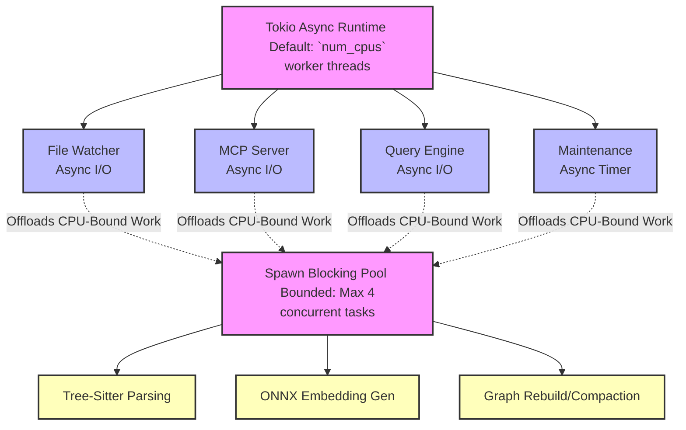
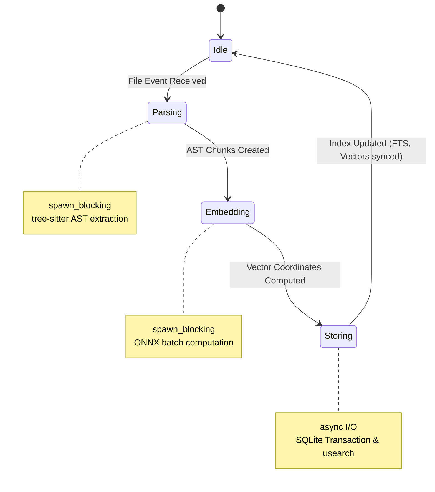

# OmniContext Concurrency Architecture

## Overview

OmniContext is a long-running process that must handle:

1. **Continuous file watching** (async I/O)
2. **Batch indexing** (CPU-bound parsing + embedding)
3. **Concurrent queries** (mixed CPU + I/O)
4. **Background maintenance** (index compaction, cache eviction)

All of these happen simultaneously. This document defines the concurrency model.

## Thread Pool Architecture



## Channel Architecture & Backpressure

```mermaid
graph LR
    classDef bounded fill:#e1f5fe,stroke:#0288d1,stroke-width:2px;
    classDef worker fill:#fff3e0,stroke:#e65100,stroke-width:2px;

    FW[File Watcher] -->|watch_tx<br>Cap: 256| PL(Indexing Pipeline):::worker

    subgraph Indexing Pipeline
        FS[File Events] -->|parse_tx<br>Cap: 64| PW[Parser Workers (2 threads)]:::worker
        PW -->|embed_tx<br>Cap: 128| EW[Embedder (1 thread, batched)]:::worker
        EW -->|store_tx<br>Cap: 64| SW[Store Worker (SQLite Tx)]:::worker
    end

    MCP[MCP Server] -->|query_tx<br>Cap: 32| QE[Query Engine]:::worker
    QE -.->|result_tx<br>oneshot| MCP
```

### Channel Capacity Rationale

| Channel    | Capacity | Rationale                                                                          | Backpressure Strategy (When Full)                           |
| :--------- | :------- | :--------------------------------------------------------------------------------- | :---------------------------------------------------------- |
| `watch_tx` | 256      | File events burst heavily; buffers os-level events safely.                         | File watcher blocks (OS buffers filesystem events).         |
| `parse_tx` | 64       | Parsing is rapid; minimizing queue size limits memory bloat.                       | Parser waits (backpressure propagates upstream to watcher). |
| `embed_tx` | 128      | Embedding is the computational bottleneck; larger buffer permits optimal batching. | Parser waits.                                               |
| `store_tx` | 64       | SQLite WAL writes execute at near-disk speed.                                      | Embedder waits.                                             |
| `query_tx` | 32       | Concurrent heuristic queries should not exceed practical hardware limits.          | MCP server rejects with `"server busy"` error code.         |

## Concurrency Rules

### Rule 1: CPU-bound Work Uses spawn_blocking

```rust
// CORRECT
let ast = tokio::task::spawn_blocking(move || {
    parser.parse(&source_code)
}).await?;

// WRONG -- blocks the async runtime
let ast = parser.parse(&source_code);
```

### Rule 2: Never Hold Mutex Across .await

```rust
// CORRECT
let data = {
    let guard = state.lock().unwrap();
    guard.clone() // release lock before await
};
let result = async_operation(data).await;

// WRONG -- deadlock risk
let guard = state.lock().unwrap();
let result = async_operation(&guard).await; // holds lock across await!
```

### Rule 3: DashMap for Shared Read-Heavy State

```rust
// Symbol table: read-heavy, write-rare
let symbols: DashMap<String, Symbol> = DashMap::new();

// Insert is rare (during indexing)
symbols.insert(fqn, symbol);

// Read is frequent (during search)
if let Some(sym) = symbols.get(&name) {
    // ...
}
```

### Rule 4: Bounded Concurrency for spawn_blocking

```rust
use tokio::sync::Semaphore;

static BLOCKING_PERMITS: Semaphore = Semaphore::const_new(4);

async fn cpu_bound_task() {
    let _permit = BLOCKING_PERMITS.acquire().await.unwrap();
    tokio::task::spawn_blocking(move || {
        // heavy CPU work
    }).await?;
    // permit auto-released
}
```

## Indexing Pipeline State Machine



## Read-Write Isolation

- **SQLite**: WAL mode ensures readers never block writers
- **usearch**: Read-only queries use a snapshot; writes append to journal
- **DashMap**: Lock-free reads, sharded writes
- **petgraph**: Protected by `RwLock` -- rebuild takes write lock, queries take read lock

## Shutdown Sequence

1. Stop file watcher (no new events)
2. Drain all channels (process remaining items)
3. Flush SQLite WAL to main database
4. Persist usearch index to disk
5. Serialize dependency graph to bincode
6. Exit
