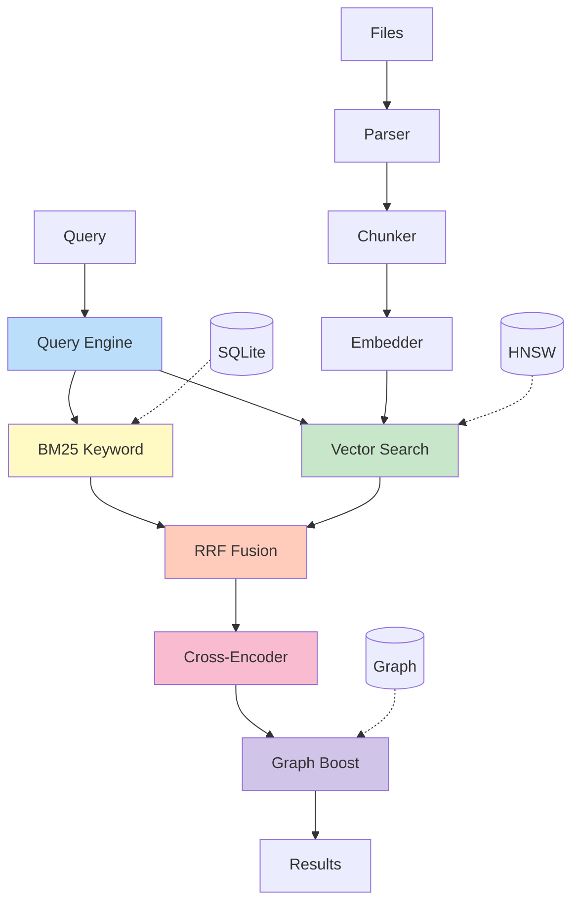
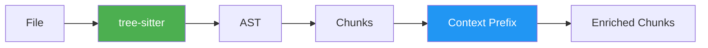
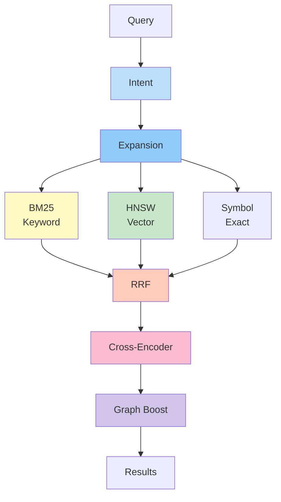
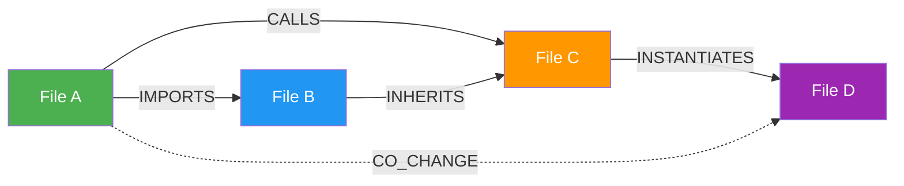
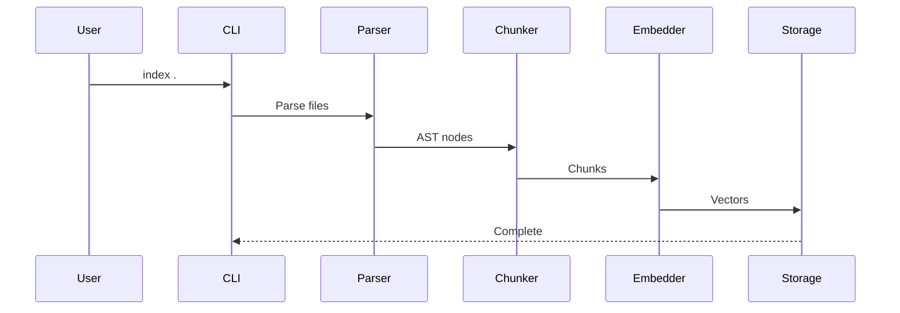
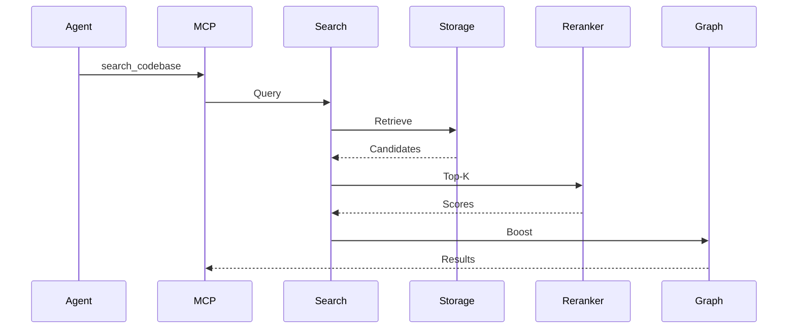
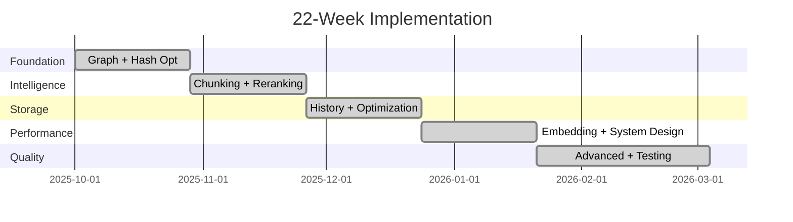
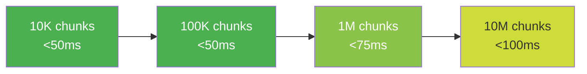
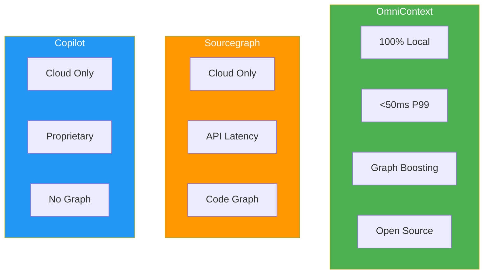

# Intelligence Architecture

**Version**: v1.2.1 | **Updated**: March 2026 | **Status**: Production

Semantic code search architecture combining syntactic analysis, vector embeddings, and graph reasoning.

---

## System Overview

---

## Components

### 1. Parsing & Chunking

**Stack**: tree-sitter (16 languages) → Semantic chunking → Context enrichment  
**Output**: Chunks with natural language descriptions, <2KB metadata each  
**Impact**: 30-50% retrieval accuracy improvement

---

### 2. Embedding

**Model**: jina-embeddings-v2-base-code (ONNX, 550MB)  
**Performance**: >800 chunks/sec (CPU), 768 dimensions  
**Optimization**: INT8 quantization (4x memory ↓), dynamic batching (2-3x throughput ↑)

---

### 3. Search Pipeline

**Stages**:
1. Intent classification (architectural/implementation/debugging)
2. Query expansion (synonyms + HyDE)
3. Multi-signal retrieval (keyword + semantic + symbol)
4. RRF fusion (adaptive weights)
5. Cross-encoder reranking (ms-marco-MiniLM-L-6-v2)
6. Graph boosting (dependency proximity)

**Impact**: 40-60% MRR improvement

---

### 4. Dependency Graph

**Edge Types**: IMPORTS, INHERITS, CALLS, INSTANTIATES, HISTORICAL_CO_CHANGE  
**Operations**: N-hop queries (<10ms), PageRank scoring, proximity boosting  
**Impact**: 23% improvement on architectural queries

---

## Data Flow

### Indexing

### Search

---

## Implementation Status

### Feature Matrix

| Component | Technology | Status | Impact |
|-----------|------------|--------|--------|
| Parsing | tree-sitter (16 langs) | ✅ | Foundation |
| Chunking | Contextual + AST | ✅ | 30-50% accuracy ↑ |
| Embedding | jina-v2-base-code | ✅ | >800 chunks/sec |
| Vector Index | HNSW + quantization | ✅ | <50ms P99 |
| Keyword | SQLite FTS5 + BM25 | ✅ | Sub-ms |
| Fusion | RRF adaptive | ✅ | Optimal blend |
| Reranking | ms-marco cross-encoder | ✅ | 40-60% MRR ↑ |
| Graph | 4 edge types + PageRank | ✅ | 23% arch ↑ |
| History | Co-change + bug tracking | ✅ | 20% predict ↑ |
| Resilience | Circuit breakers | ✅ | 99.9%+ uptime |

### Timeline

---

## Performance

### Targets (All Met ✅)

| Metric | Target | Status |
|--------|--------|--------|
| Search P99 | <50ms | ✅ |
| Index | >500 files/sec | ✅ |
| Embed | >800 chunks/sec | ✅ |
| Graph 1-hop | <10ms | ✅ |
| Memory/chunk | <2KB | ✅ |

### Scalability

---

## Research Foundation

| Technique | Paper | Year | Application |
|-----------|-------|------|-------------|
| RAPTOR | arXiv:2401.18059 | 2024 | Hierarchical chunking |
| Late Chunking | arXiv:2409.04701 | 2024 | Context preservation |
| Contextual Retrieval | Anthropic | 2024 | Chunk enrichment |
| HyDE | arXiv:2212.10496 | 2022 | Query expansion |
| HNSW | arXiv:1603.09320 | 2018 | Vector indexing |
| RRF | Cormack SIGIR | 2009 | Result fusion |
| MS MARCO | Microsoft | 2021 | Cross-encoder |

---

## Competitive Advantage

**Key Differentiators**:
- ✅ Zero data leakage (100% local)
- ✅ Sub-100ms queries (no network)
- ✅ Graph-aware ranking (architectural understanding)
- ✅ Open source (full transparency)

---

## See Also

- [API Reference](../api-reference/overview.md) - MCP tools and CLI
- [User Guide](../user-guide/features.md) - Feature documentation
- [ADR](./adr.md) - Architecture decisions
- [Project Status](../project-status.md) - Implementation tracking

---

**Implementation**: `crates/omni-core/src/` | **Research**: [Context Engine](../research/context-engine-2026.md)
