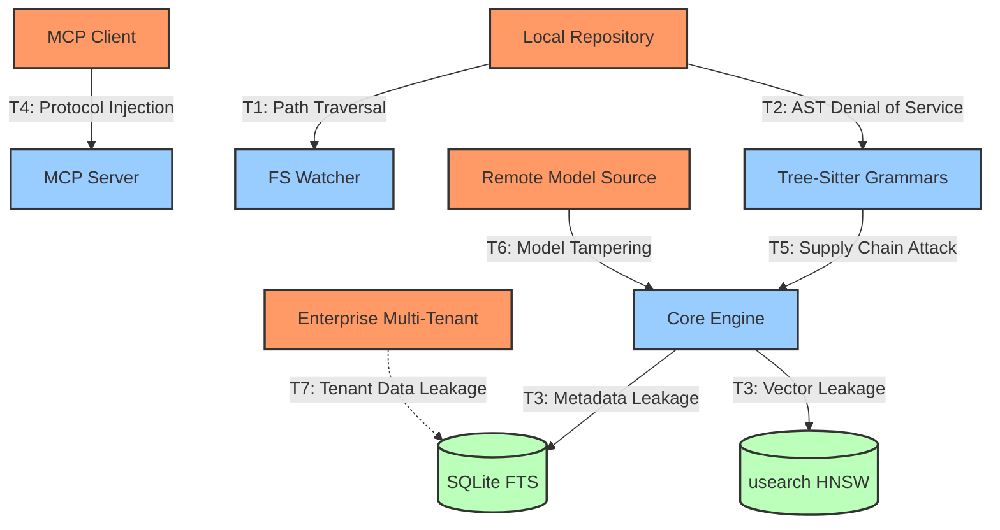

# OmniContext Security & Threat Model

This document outlines the formalized threat model and mitigation architecture for the OmniContext local and enterprise execution environments.

## Threat Surface Architecture



## Threat Vector Analysis & Mitigations

### T1: Path Traversal via Symlinks

**Threat**: A repository contains symlinks pointing outside the indexed boundary (e.g., `../../.ssh/id_rsa`). The indexer follows the symlink, exposing sensitive out-of-bounds files to the AI agent.
**Mitigation**:

- Strict boundary enforcement using `fs::canonicalize`.
- Canonical paths are verified to strictly start with the defined `repo_root`.
- Default: Symlinks are ignored unless explicitly configured overriding security defaults.

### T2: AST-Based Denial of Service

**Threat**: Malformed or aggressively nested files (e.g., 1,000+ levels of nested brackets) induce exponential memory/time consumption in `tree-sitter`.
**Mitigation**:

- Hard execution timeouts: Max parse time of `10s` per file.
- Disk constraints: Files > `5MB` are skipped automatically.
- Stack boundary: Max AST depth traversal capped at `50` levels.

### T3: Index Metadata Leakage

**Threat**: The persistent index directory (`~/.omnicontext/repos/<hash>/`) contains structural blueprints of proprietary codebases.
**Mitigation**:

- Strict OS-level permissions: `0700` (Owner-only) on Linux/macOS, restricted User-ACL on Windows.
- Cryptographic capability (Enterprise): AES-256 encryption at rest.

### T4: MCP Protocol Injection

**Threat**: A malicious MCP client or hijacked AI agent sends payload injections to exploit SQLite or induce excessive disk I/O.
**Mitigation**:

- `rusqlite` parameterized statements enforced unconditionally. No raw string interpolation exists.
- Query timeouts hardcoded to `5s`.
- Payload constraints: Max query length capped at `10,000` bytes.

### T5: Supply Chain Attack via Grammars

**Threat**: Community `tree-sitter` grammars executing malicious native code via `build.rs` or runtime FFI.
**Mitigation**:

- Grammars are vendored and version-pinned in `Cargo.toml`.
- Sourced exclusively from the official `tree-sitter` GitHub organization.
- Runtime occurs within memory-safe Rust bounds where feasible; future roadmap isolates grammars in WASM.

### T6: ONNX Model Tampering

**Threat**: Intercepted or modified `.onnx` model files executing arbitrary computation paths.
**Mitigation**:

- Cryptographic hash verification (`SHA256`) against known-good binaries upon initialization.
- Model graph execution occurs within the sandboxed limits of the `ort` ONNX Runtime layer.

### T7: Multi-Tenant Data Isolation (Enterprise)

**Threat**: Horizontal privilege escalation leaking `Tenant A` index data to `Tenant B`.
**Mitigation**:

- Process-level isolation: Each tenant executes in an isolated container instance with dedicated SQLite databases.
- Network security: Strict TLS 1.3 enforcement with JWT (`RS256`) API keys rotating every 90 days.

## Development Security Operations (DevSecOps)

The CI/CD pipeline enforces the following cryptographic and licensing invariants prior to any merge to `main`:

```bash
cargo audit                      # Checks against the rustsec advisory database
cargo deny check advisories      # Enforces organizational vulnerability limits
cargo deny check licenses        # Blocks non-compliant open-source licenses
```

**Content Security Policy**: Under no circumstances will file contents or unhashed repository paths be logged via `tracing` at the `INFO` level or higher.
