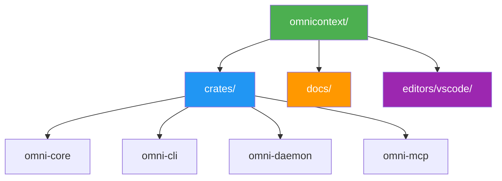

# Contributing

**License**: Apache 2.0 | **Process**: Fork → PR → Review → Merge

---

## Quick Start

```bash
# Fork on GitHub, then:
git clone https://github.com/YOUR_USERNAME/omnicontext.git
cd omnicontext
git checkout -b feat/your-feature

# Build & test
cargo build --workspace --release
cargo test --workspace
cargo fmt --all -- --check
cargo clippy --workspace -- -D warnings
```

---

## Workflow


---

## Requirements

| Check | Command |
|-------|---------|
| Format | `cargo fmt` |
| Lint | `cargo clippy -- -D warnings` |
| Test | `cargo test --workspace` |
| Docs | Add doc comments for public APIs |

---

## Project Structure



---

## Contribution Areas

### Bug Fixes
- Check [Issues](https://github.com/steeltroops-ai/omnicontext/issues)
- Look for `good first issue`
- Write failing test → Fix → Verify

### Features
- Discuss in [Discussions](https://github.com/steeltroops-ai/omnicontext/discussions)
- Check [Roadmap](../roadmap.md)
- Design proposal for large features

### Documentation
- Fix errors, add examples
- Use Mermaid diagrams
- Follow [Documentation Standards](../../.kiro/steering/documentation-standards.md)

### Testing
- See [Testing Guide](./testing.md)
- Coverage targets: 75-90%
- Add benchmarks for performance paths

### Language Support
- See [Add Language Workflow](../../.agents/workflows/add-language.md)
- Implement `LanguageParser` trait
- ~3 days timeline

---

## PR Checklist

- [ ] Builds without errors
- [ ] Tests pass
- [ ] Linters pass (fmt, clippy)
- [ ] Docs updated
- [ ] Commits follow [conventions](../../.agents/workflows/commit-conventions.md)
- [ ] Branch up-to-date with main

### PR Template

```markdown
## What
Brief description

## Why
Reason for change

## How
Implementation approach

## Testing
How tested

## Breaking
Any breaking changes?
```

---

## Code of Conduct

- Be respectful and inclusive
- Constructive feedback only
- Focus on code, not person

---

## Help

- Questions: [Discussions](https://github.com/steeltroops-ai/omnicontext/discussions)
- Bugs: [Issues](https://github.com/steeltroops-ai/omnicontext/issues)

---

## See Also

- [Testing Guide](./testing.md)
- [Development Rules](../../.kiro/steering/development-rules.md)
- [Commit Conventions](../../.agents/workflows/commit-conventions.md)
