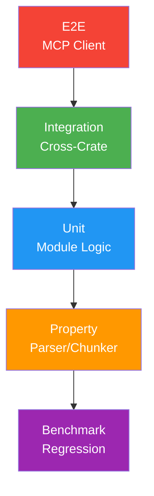

# Testing Strategy

**Coverage**: >80% all crates | **CI**: Regression guards | **Status**: Production

Testing pyramid and validation architecture.

---

## Test Pyramid



---

## Coverage Targets

| Crate | Domain | Target |
|-------|--------|--------|
| parser | AST extraction | ≥90% |
| chunker | Token boundaries | ≥90% |
| embedder | ONNX interface | ≥80% |
| index | SQLite persistence | ≥85% |
| search | Ranking algorithms | ≥85% |
| graph | Dependency traversal | ≥80% |
| omni-mcp | Protocol compliance | ≥75% |

---

## Test Types

### Unit Tests
Location: `#[cfg(test)] mod tests` in source files  
Focus: Isolated module logic

### Property-Based (proptest)
Target: Parser/chunker correctness  
Assertions:
- Chunkers never exceed token limits
- Zero character loss (all code mapped)
- No panics on malformed input

### Integration Tests
Location: `tests/fixtures/`  
Fixtures:
- `python_project/` - OOP structure
- `typescript_project/` - Import boundaries
- `monorepo/` - Multi-package
- `edge_cases/` - Pathological inputs

### Benchmarks (Criterion)
Threshold: >10% regression fails CI  
Artifacts: 30-day retention

### Search Quality (NDCG)
Target: NDCG@10 > 0.75  
Dataset: `tests/bench/golden_queries.json`

---

## Run Tests

```bash
# All tests
cargo test --workspace

# Coverage
cargo tarpaulin --out Html

# Benchmarks
cargo bench --package omni-core

# Integration only
cargo test --test '*'

# Property tests
cargo test --package omni-core -- proptest
```

---

## See Also

- [Benchmark README](../../crates/omni-core/benches/README.md)
- [CI Workflow](../../.github/workflows/test.yml)
