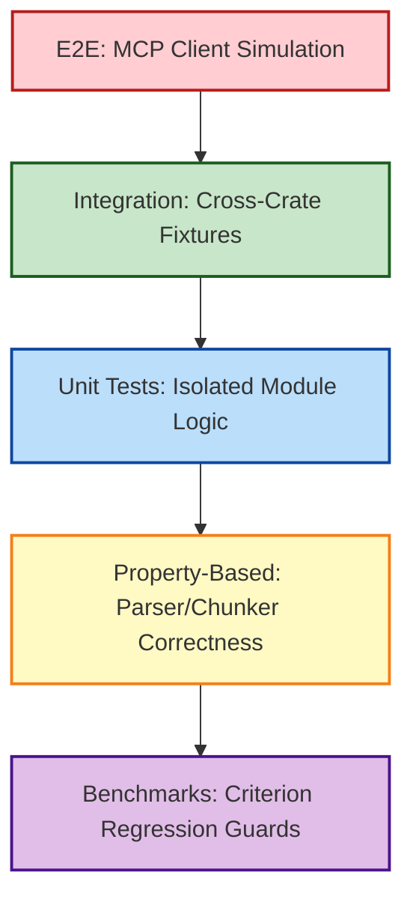

# OmniContext Testing & Validation Strategy

This document establishes the strict testing pyramid, code coverage benchmarks, and verification architectures governing the OmniContext Engine. All commits must fulfill these testing specifications before merging.

## Test Pyramid Architecture

## Unit Testing Directives

### Implementation Constraints

Unit tests must reside identically alongside the logic they evaluate inside a `#[cfg(test)] mod tests` isolation block.

### Code Coverage Minimums

| Crate                 | Logic Domain           | Minimum Target Coverage |
| :-------------------- | :--------------------- | :---------------------- |
| `omni-core::parser`   | AST grammar extraction | `>= 90%`                |
| `omni-core::chunker`  | Token boundaries       | `>= 90%`                |
| `omni-core::embedder` | ONNX Model interfacing | `>= 80%`                |
| `omni-core::index`    | SQLite persistency     | `>= 85%`                |
| `omni-core::search`   | Ranking algorithms     | `>= 85%`                |
| `omni-core::graph`    | Dependency traversals  | `>= 80%`                |
| `omni-mcp`            | Protocol compliance    | `>= 75%`                |

## Property-Based Testing (Proptest)

The AST extraction and chunking engines operate against unbounded, non-deterministic human execution vectors (source code). To secure the logic against panics, all string parsers must undergo `proptest` validation testing string mutations.

_Assertion Targets:_

- Chunkers never exceed max token thresholds.
- Chunkers drop `0` characters (all original code maps to a chunk).
- The `tree-sitter` parser never panics on malformed arrays/trees.

## Integration Testing (Repository Fixtures)

Integration tests validate the SQLite Database, usearch Vector Matrix, and MCP Server in tandem.

**Fixture Topology (`tests/fixtures/`)**:

- `python_project/`: Standard OOP testing structure.
- `typescript_project/`: JavaScript/TS import boundary mapping.
- `monorepo/`: Multi-package workspace resolution.
- `edge_cases/`: Pathological boundary inputs (e.g., 20 levels of nesting, 10k line single-file, circular imports).

## Telemetry & Benchmarking (Criterion)

Performance constraints are strictly managed via `cargo bench` and the `criterion` crate.

- **Threshold Guard**: If any benchmark regresses by `> 10%`, the PR pipeline fails.
- CI preserves execution results as artifacts to analyze month-over-month telemetry trends.

## Search Relevance Validation (NDCG)

The Engine executes an NDCG (Normalized Discounted Cumulative Gain) validation suite targeting heuristic accuracy over dense and sparse querying.

**Target Threshold**: `NDCG@10 > 0.85` across standard fixture repositories.
