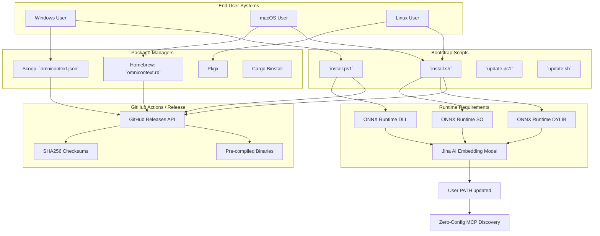

# OmniContext Distribution Systems

This subsystem governs the deployment paths, package manager integrations, and automated dependency resolution (ONNX Runtime, Jina Embeddings) required to initialize OmniContext across operating systems.

## Distribution Architecture



## Supported Channels

### Zero-Config Shell Scripts

Directly bootstrap the target architecture, inject dependencies, and configure the user path.

**Windows PowerShell**:

```powershell
irm https://raw.githubusercontent.com/steeltroops-ai/omnicontext/main/distribution/install.ps1 | iex
```

**macOS/Linux Bash**:

```bash
curl -fsSL https://raw.githubusercontent.com/steeltroops-ai/omnicontext/main/distribution/install.sh | bash
```

### Managed Packages

Manifests hosted in external tap repositories.

- **Scoop (Windows)**: `distribution/scoop/omnicontext.json`
- **Homebrew (macOS/Linux)**: `distribution/homebrew/omnicontext.rb`

## Post-Install Resolution (Dependencies)

To execute semantic embedding, OmniContext requires ONNX Runtime 1.23.0 and the `jina-embeddings-v2-base-code` model.

The distribution scripts actively fetch these during installation:

1. **Windows**: Downloads `onnxruntime-win-x64-1.23.0.zip` from Microsoft directly to `$HOME\.omnicontext\bin`.
2. **Unix**: Downloads `onnxruntime-linux-x64` or `onnxruntime-osx` and links the libraries automatically via `.dll`, `.so`, or `.dylib` co-location.
3. Automatically triggers `omnicontext setup model-download` during bootstrap to cache the 550MB model cleanly.

## Release Process Map

1. Bump version across all `Cargo.toml` targets.
2. Build matrix targets (`x86_64-pc-windows-msvc`, `aarch64-apple-darwin`, `x86_64-apple-darwin`, `x86_64-unknown-linux-gnu`).
3. Generate SHA256 checksums per binary artifact.
4. Update `distribution/scoop/omnicontext.json` and `distribution/homebrew/omnicontext.rb` strictly matching new SHA256 values.
5. Create standard GitHub Release attached to the newly pushed Git tag.
6. Execution scripts automatically resolve `latest` tag against the GitHub Releases API.
