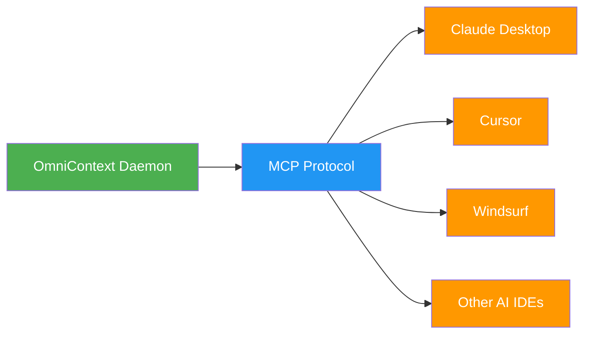

# Quick Start Guide

Get OmniContext running in 5 minutes.

---

## Installation

Choose your platform:

### Windows

```powershell
irm https://raw.githubusercontent.com/steeltroops-ai/omnicontext/main/distribution/install.ps1 | iex
```

### macOS / Linux

```bash
curl -fsSL https://raw.githubusercontent.com/steeltroops-ai/omnicontext/main/distribution/install.sh | bash
```

---

## Basic Usage


### 1. Index Your Repository

```bash
cd /path/to/your/project
omnicontext index .
```

This creates:
- SQLite database with code chunks
- Vector embeddings for semantic search
- Dependency graph for architectural context

### 2. Search Your Code

```bash
omnicontext search "authentication middleware" --limit 5
```

Returns ranked results with:
- Code chunks
- File paths and line numbers
- Relevance scores

### 3. Start the Daemon (Optional)

For MCP integration with AI agents:

```bash
omnicontext-daemon
```

The daemon:
- Runs in the background
- Auto-updates on file changes
- Exposes MCP tools to AI agents

---

## MCP Integration



### Auto-Configuration

OmniContext automatically configures:
- Claude Desktop (`claude_desktop_config.json`)
- Cursor (`cursor.mcp/config.json`)
- Windsurf (`mcp_config.json`)
- Kiro (`.kiro/settings/mcp.json`)
- Continue.dev (`config.json`)

No manual setup required!

---

## Verify Installation

```bash
# Check version
omnicontext --version

# Check status
omnicontext status

# View help
omnicontext --help
```

---

## Next Steps

- **[Features](../user-guide/features.md)** - Learn about all capabilities
- **[MCP Tools](../api-reference/mcp-tools.md)** - Integrate with AI agents
- **[Supported Languages](../reference/supported-languages.md)** - Check language support

---

## Troubleshooting

### Index Not Created

```bash
# Check if directory is a git repository
git status

# Try with explicit path
omnicontext index /full/path/to/project
```

### Model Download Fails

```bash
# Check internet connection
# Model is ~550MB, may take time

# Retry download
omnicontext setup model-download
```

### Daemon Won't Start

```bash
# Check if port is available
# Default: localhost:3000

# Check logs
omnicontext-daemon --log-level debug
```

---

## Support

- **[Installation Guide](./installation.md)** - Detailed installation instructions
- **[GitHub Issues](https://github.com/steeltroops-ai/omnicontext/issues)** - Report bugs
- **[Discussions](https://github.com/steeltroops-ai/omnicontext/discussions)** - Ask questions
