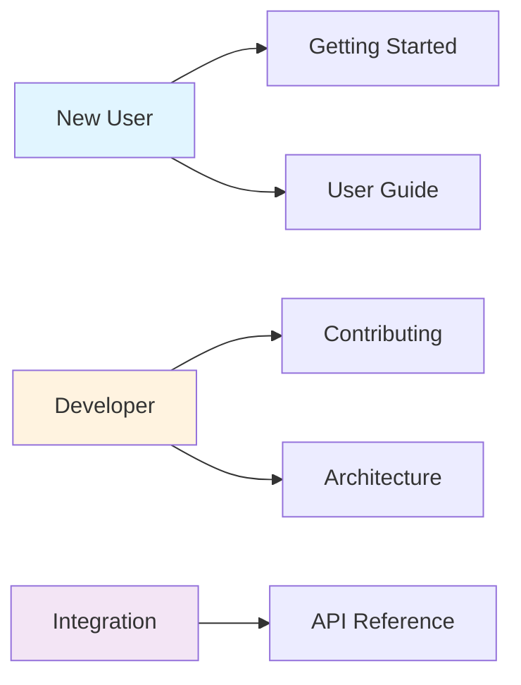
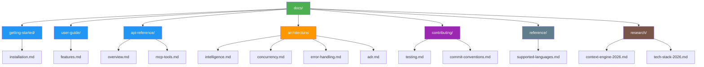

# OmniContext Documentation

**Version**: v0.14.0  
**Last Updated**: March 9, 2026

Complete documentation for the OmniContext semantic code search engine.

---

## Quick Navigation

---

## Getting Started

New to OmniContext? Start here:

- **[Installation](./getting-started/installation.md)** - Install OmniContext on your system
- **[Quick Start](../README.md#quick-start)** - Get up and running in 5 minutes

---

## User Guide

Learn how to use OmniContext:

- **[Features](./user-guide/features.md)** - Complete feature documentation
- **[Supported Languages](./reference/supported-languages.md)** - 16 supported programming languages

---

## API Reference

Integrate OmniContext with AI agents:

- **[API Overview](./api-reference/overview.md)** - CLI and MCP interface
- **[MCP Tools](./api-reference/mcp-tools.md)** - 6 MCP tools for AI agents

---

## Architecture

Understand the system design:

- **[Intelligence Layer](./architecture/intelligence.md)** - Search and ranking architecture
- **[Concurrency](./architecture/concurrency.md)** - Concurrency patterns
- **[Error Handling](./architecture/error-handling.md)** - Error recovery strategies
- **[ADR](./architecture/adr.md)** - Architecture Decision Records

---

## Contributing

Help improve OmniContext:

- **[Testing](./contributing/testing.md)** - Testing strategy and coverage
- **[Commit Conventions](./contributing/commit-conventions.md)** - Commit message standards

---

## Reference

Technical references:

- **[Supported Languages](./reference/supported-languages.md)** - Language support matrix
- **[Project Status](./project-status.md)** - Implementation tracking (100% complete)
- **[Roadmap](./roadmap.md)** - Future features and vision

---

## Research

Research documents and analysis:

- **[Context Engine Research](./research/context-engine-2026.md)** - Intelligence layer research
- **[Tech Stack Analysis](./research/tech-stack-2026.md)** - Technology stack decisions

---

## Documentation Structure

---

## Support

- **Issues**: [GitHub Issues](https://github.com/steeltroops-ai/omnicontext/issues)
- **Discussions**: [GitHub Discussions](https://github.com/steeltroops-ai/omnicontext/discussions)

---

## License

Apache License 2.0 - See [LICENSE](../LICENSE)
