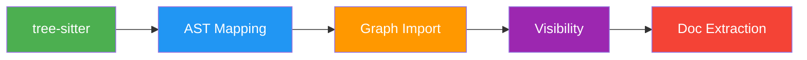

# Supported Languages

**Total**: 16 languages | **Parser**: tree-sitter AST | **Status**: Production

Language support matrix for semantic code search.

---

## Language Matrix

| Language | Grammar | AST | Graph | Tests | Status |
|----------|---------|-----|-------|-------|--------|
| Python | tree-sitter-python | ✅ | ✅ | ✅ | Core |
| TypeScript | tree-sitter-typescript | ✅ | ✅ | ✅ | Core |
| JavaScript | tree-sitter-javascript | ✅ | ✅ | ✅ | Core |
| Rust | tree-sitter-rust | ✅ | ✅ | ✅ | Core |
| Go | tree-sitter-go | ✅ | ✅ | ✅ | Core |
| Java | tree-sitter-java | ✅ | ✅ | ✅ | Extended |
| C/C++ | tree-sitter-c/cpp | ✅ | ✅ | ✅ | Extended |
| C# | tree-sitter-c-sharp | ✅ | ✅ | ✅ | Extended |
| CSS | tree-sitter-css | ✅ | ❌ | ✅ | Extended |
| Ruby | tree-sitter-ruby | ✅ | ✅ | ✅ | Baseline |
| PHP | tree-sitter-php | ✅ | ✅ | ✅ | Baseline |
| Swift | tree-sitter-swift | ✅ | ✅ | ✅ | Baseline |
| Kotlin | tree-sitter-kotlin-ng | ✅ | ✅ | ✅ | Baseline |
| Markdown | - | ✅ | ❌ | ✅ | Docs |
| TOML | - | ✅ | ❌ | ✅ | Docs |
| JSON | - | ✅ | ❌ | ✅ | Docs |

---

## Integration Requirements

### 1. AST Mapping
Map tree-sitter nodes to internal types:
- `function`, `class`, `trait`, `impl`, `const`, `type`, `module`, `test`

### 2. Graph Import Resolution
Language-specific import detection:
- Python: `import | from | importlib`
- TS/JS: `import | require() | barrel`
- Rust: `use | mod | pub use`
- Go: `import`

### 3. Visibility Boundaries
Encapsulation detection:
- Python: Heuristic (`_` prefix = private)
- TS/JS: Static (`export` tokens)
- Rust: Explicit (`pub / pub(crate)`)
- Go: Syntactic (Capitalized = public)

### 4. Doc Extraction
Comment parsing:
- Python: `"""..."""`
- TS/Java: `/**...*/`
- Rust: `///`

---

## Add Language

Follow workflow: `.agents/workflows/add-language.md`  
Timeline: ~3 engineering days

---

## See Also

- [Add Language Workflow](../../.agents/workflows/add-language.md)
- [Parser Implementation](../../crates/omni-core/src/parser/languages/)
