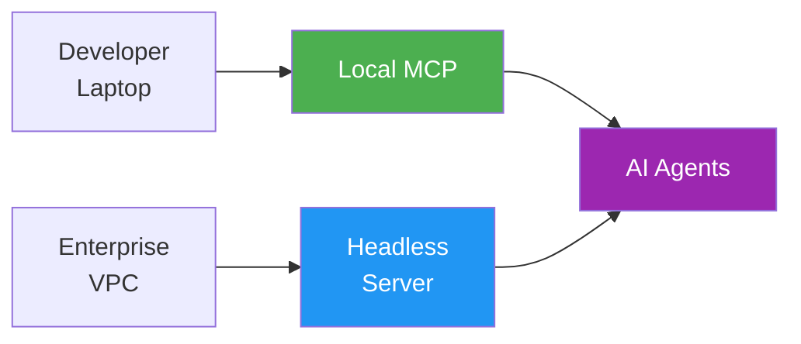
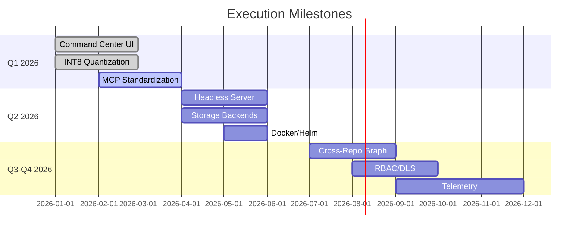

# Roadmap

**Mission**: Universal codebase intelligence layer for AI agents  
**Target**: Every developer laptop + every enterprise VPC  
**Status**: Production-ready local, enterprise features in progress

---

## Vision

**Success**: Standard MCP component, zero-config install, absolute privacy

---

## Current State

## Current State

| Component | Status | Advantage |
|-----------|--------|-----------|
| AST Parser | ✅ 16 languages | Semantic boundaries, not text splitting |
| Embeddings | ✅ Local ONNX | jina-v2 + cross-encoder reranking |
| Graph | ✅ Dependency aware | 1-hop proximity boosting |
| Search | ✅ Hybrid RRF | Vector + keyword + symbol |
| VS Code | ✅ Extension | MCP command center |

---

## vs Competition

| Feature | OmniContext | Cursor | Sourcegraph | Copilot |
|---------|-------------|--------|-------------|---------|
| Execution | 100% Local | Cloud | Cloud/On-prem | Cloud |
| Parsing | AST (tree-sitter) | AST/Heuristic | AST (SCIP) | Heuristic |
| Graph | Dynamic 1-hop | Limited | Global | Limited |
| Privacy | Air-gapped | ❌ | ❌ | ❌ |

---

## Timeline

---

## Stage 1: Developer Standard

**Goal**: Zero-friction local MCP server

### Features

**Zero-Config Install**:
- Single command setup
- Auto-configure MCP clients
- Package managers (Homebrew, npm, cargo-binstall)

**Resource Optimization**:
- INT8 quantization (4x memory ↓)
- Idle model unloading (5min timeout)
- Incremental AST updates (1-5% CPU)

**Command Center Sidebar**:
- Context inspector (show what AI sees)
- Health diagnostics
- Index management UI
- Token budget sliders
- Client sync dashboard

**Intent Search**:
- Replace Cmd+Shift+F
- Framework-aware weights (Next.js, Axum, FastAPI)

---

## Stage 2: Enterprise Standard

**Goal**: Replace Sourcegraph/Copilot Enterprise

### Features

**Multi-Repo Workspace**:
- Global code graph across repos
- Cross-repo import resolution
- SCIP-compatible topology

**Client-Server Architecture**:
- Headless Kubernetes deployment
- Git webhook indexing
- gRPC/REST thin clients
- Corporate GPU utilization

**Security**:
- Role-based access control (RBAC)
- Document-level security (DLS)
- ACL-filtered vector search

**Storage Backends**:
- PostgreSQL metadata
- Qdrant/Milvus vectors
- Terabyte-scale indexing

**Observability**:
- Telemetry dashboards
- Auto-tuning reranker
- Context utility metrics

---

## Future Intelligence

### Binary Quantization
- 1-bit vectors (nomic-embed)
- Hamming distance (XOR)
- 10M vectors in 5ms
- KB memory vs GB

### Graph RAG
- Semantic knowledge graph
- Control flow graphs (CFG)
- Execution trace queries
- "API → DB" flow analysis

### ColBERT
- Late interaction encoding
- Per-token embeddings
- Keyword + semantic fusion
- Variable-level precision

### DiskANN
- Vamana graph index
- 95% vectors on SSD
- Sub-3ms billion-scale
- Terabyte enterprise scale

---

## See Also

- [Architecture](./architecture/intelligence.md)
- [Features](./user-guide/features.md)
- [Project Status](./project-status.md)
