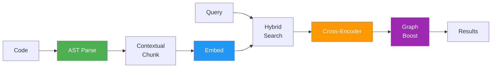
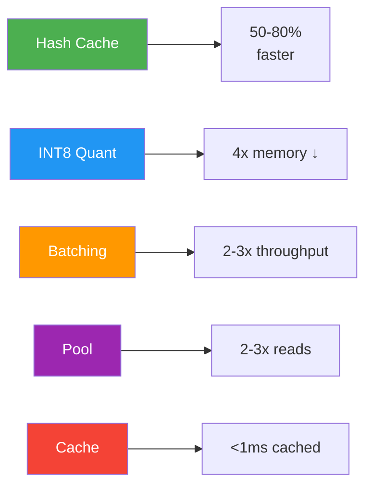
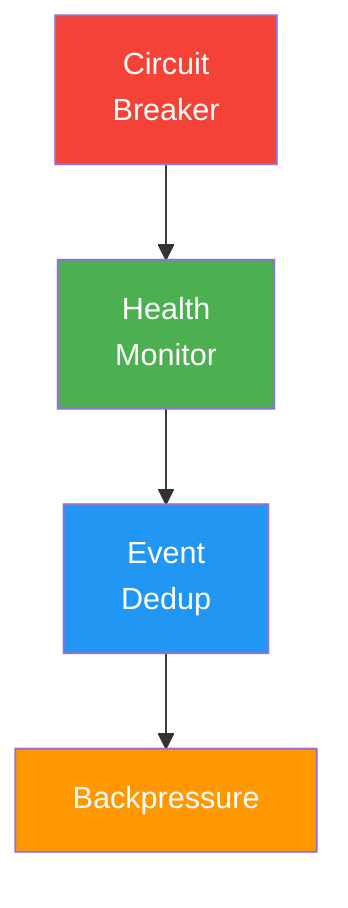
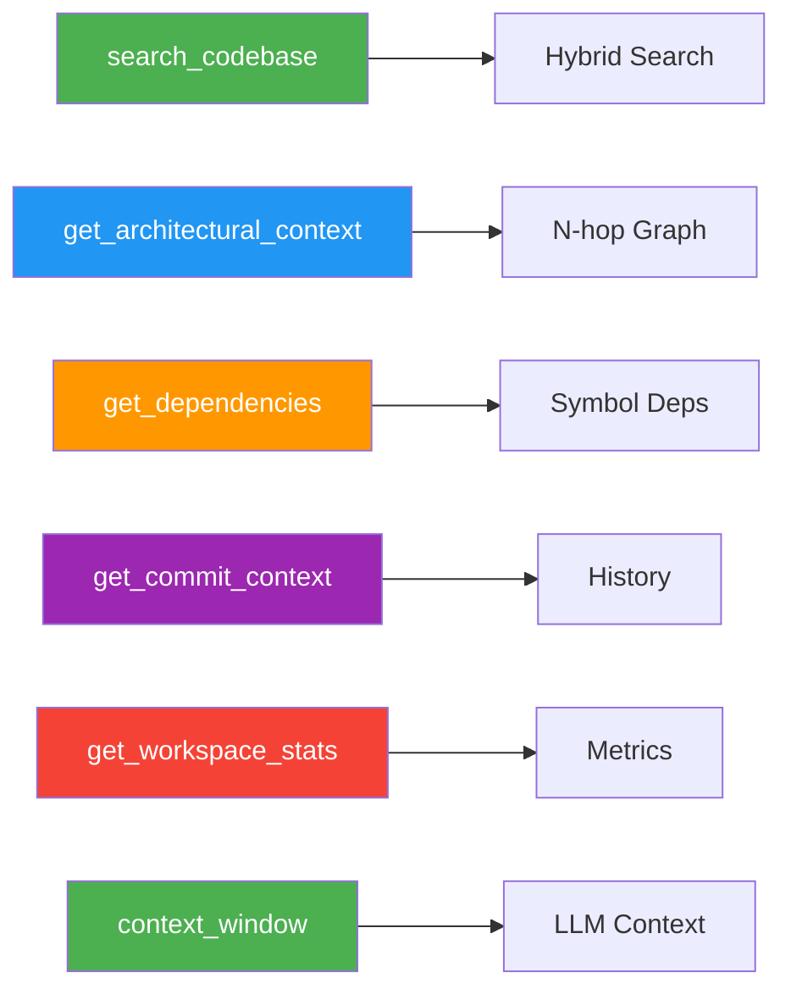

# Features

**Version**: v0.14.0 | **Updated**: March 2026 | **Status**: Production

Semantic code search engine features.

---

## Intelligence Layer

### Contextual Chunking
- Natural language descriptions for chunks
- Name-based heuristics (get_, validate_, create_)
- Doc comment extraction
- Module path context
- Impact: 30-50% accuracy ↑

### Cross-Encoder Reranking
- jina-reranker-v2-base-multilingual (~280MB)
- Batch processing (default: 32)
- Early termination (40-60% faster)
- Graceful degradation
- Impact: 40-60% MRR ↑

### Graph-Boosted Ranking
- 4 edge types: IMPORTS, INHERITS, CALLS, INSTANTIATES
- N-hop queries (<10ms)
- PageRank scoring
- Proximity boosting
- Impact: 23% architectural ↑

### Historical Context
- Co-change detection
- Bug-prone file tracking
- Last 1000 commits indexed
- Diff statistics
- Impact: 20% bug fix ↑

### Multi-Repository
- Priority weighting (0.0-1.0)
- Cross-repo search
- Dynamic priority adjustment
- Workspace statistics

---

## Performance

| Feature | Impact | Status |
|---------|--------|--------|
| Hash-Based Change Detection | 50-80% re-index ↓ | ✅ |
| INT8 Quantization | 4x memory ↓, 1.75x speed ↑ | 🔧 |
| Dynamic Batching | 2-3x throughput ↑ | ✅ |
| Connection Pooling | 2-3x read ↑ | ✅ |
| Query Caching | <1ms cached | ✅ |
| IPC Compression | 5-10x size ↓ | ✅ |

---

## System Design

| Component | Purpose | Impact |
|-----------|---------|--------|
| Circuit Breakers | Prevent cascading failures | 99.9%+ uptime |
| Health Monitoring | Track subsystem health | Auto-recovery |
| Event Deduplication | Skip duplicate IDE events | Reduced CPU |
| Backpressure | Reject excess requests | Stable under load |

---

## Quality Assurance

| Feature | Metrics | Target |
|---------|---------|--------|
| Benchmarks | Criterion + Binary | Detect regressions |
| NDCG | Search quality | >0.85 |
| Regression Detection | CI threshold | 10% max |
| Commit History | Last 1000 commits | Context |

---

## Language Support

**16 Languages**: Python, TypeScript, JavaScript, Rust, Go, Java, C/C++, C#, CSS, Ruby, PHP, Swift, Kotlin, Markdown, TOML, JSON

See [Supported Languages](../reference/supported-languages.md)

---

## MCP Tools

| Tool | Purpose |
|------|---------|
| search_codebase | Hybrid semantic + keyword search |
| get_architectural_context | N-hop dependency neighborhood |
| get_dependencies | Direct symbol dependencies |
| get_commit_context | Relevant commit history |
| get_workspace_stats | Repository statistics |
| context_window | Token-optimized LLM context |

See [MCP Tools](../api-reference/mcp-tools.md)

---

## Performance Targets

| Metric | Target | Status |
|--------|--------|--------|
| File Indexing | >500 files/sec | ✅ |
| Embedding | >800 chunks/sec | ✅ |
| Search P99 | <50ms | ✅ |
| Graph 1-hop | <10ms | ✅ |
| Memory/chunk | <2KB | ✅ |

---

## See Also

- [MCP Tools](../api-reference/mcp-tools.md)
- [Architecture](../architecture/intelligence.md)
- [Benchmarks](../../crates/omni-core/benches/README.md)
- [Supported Languages](../reference/supported-languages.md)
