# OmniContext VS Code Extension

[](https://marketplace.visualstudio.com/items?itemName=steeltroops.omnicontext&ssr=false#overview)
[](https://open-vsx.org/extension/steeltroops/omnicontext)
Provides intelligent pre-fetch caching and automatic semantic context injection capabilities, bridging the OmniContext daemon and AI assistants within Visual Studio Code.

## Architecture



## System Implementation Constraints

The extension uses strict TypeScript, compiled via Bun, and targets standard `vscode` APIs without external heavy dependencies. Use `bun` exclusively for dependency management.

### Compilation & Testing

```bash
cd editors/vscode
bun install
bun run compile
bun run test
bun run package
```

### Execution Mapping

Launch the Extension Development Host (`F5` in VS Code) from the `editors/vscode` workspace context. Alternatively, execute via CLI:

```bash
code --extensionDevelopmentPath=./editors/vscode
```

### Extension Configuration Directives

- `omnicontext.prefetch.enabled`: Master toggle for predictive caching mechanism.
- `omnicontext.prefetch.cacheSize`: Memory-bound LRU cache entry limit.
- `omnicontext.prefetch.cacheTtlSeconds`: Invalidation window for pre-fetched semantic context.
- `omnicontext.prefetch.debounceMs`: Inter-event filter window preventing RPC flooding.

## Subsystems

1. **EventTracker**: Filters high-frequency `TextDocumentChangeEvent` streams via strict debounce mechanisms, querying only on stable cursor displacement.
2. **SymbolExtractor**: Discovers active code boundaries via `vscode.executeDocumentSymbolProvider`, allowing localized AST context expansion.
3. **IPC Client**: Pipes queries asynchronously over `\\.\pipe\omnicontext-ipc` (Windows) or `/tmp/omnicontext-ipc.sock` (Unix). Implements an `isDaemonConnected` circuit breaker to prevent IDE serialization freezes.

## Diagnostics & Telemetry

Monitor extension performance and state via standard VS Code diagnostic channels:

1. **Output Channel**: View -> Output -> Select `OmniContext`. Logs all daemon lifecycle events and IPC transitions.
2. **Developer Tools**: Help -> Toggle Developer Tools. Inspect unhandled Promise rejections or UI thread blockers.

**Target Performance Boundaries:**

- Event processing: `<5ms`
- IPC round-trip: `<10ms`
- Sidebar refresh: `<100ms`
- Object memory allocation: `<50MB`
