# Architecture

OmniContext combines syntactic analysis, vector embeddings, and graph reasoning for semantic code search.

## System Overview

The system consists of four main components working together to provide fast, accurate semantic code search.

```mermaid
graph TB
    subgraph Input["Input Layer"]
        Files[Source Files]
        Query[Search Query]
    end
    
    subgraph Processing["Processing Layer"]
        Parser[Tree-sitter Parser]
        Chunker[Semantic Chunker]
        Embedder[ONNX Embedder]
        QE[Query Engine]
    end
    
    subgraph Storage["Storage Layer"]
        SQLite[(SQLite FTS5)]
        HNSW[(HNSW Index)]
        Graph[(Dependency Graph)]
    end
    
    subgraph Search["Search Layer"]
        BM25[BM25 Keyword]
        Vector[Vector Search]
        Symbol[Symbol Match]
        RRF[RRF Fusion]
        Rerank[Cross-Encoder]
        GraphBoost[Graph Boost]
    end
    
    Files --> Parser
    Parser --> Chunker
    Chunker --> Embedder
    Embedder --> HNSW
    Chunker --> SQLite
    Parser --> Graph
    
    Query --> QE
    QE --> BM25
    QE --> Vector
    QE --> Symbol
    
    SQLite --> BM25
    HNSW --> Vector
    Graph --> Symbol
    
    BM25 --> RRF
    Vector --> RRF
    Symbol --> RRF
    
    RRF --> Rerank
    Rerank --> GraphBoost
    Graph --> GraphBoost
    GraphBoost --> Results[Search Results]
    
    style Input fill:#1a1a1f
    style Processing fill:#1a1a1f
    style Storage fill:#1a1a1f
    style Search fill:#1a1a1f
    style Results fill:#10b981,color:#000
```

## Data Flow Architecture

### Indexing Pipeline

The indexing pipeline processes source files through multiple stages to build searchable indexes.

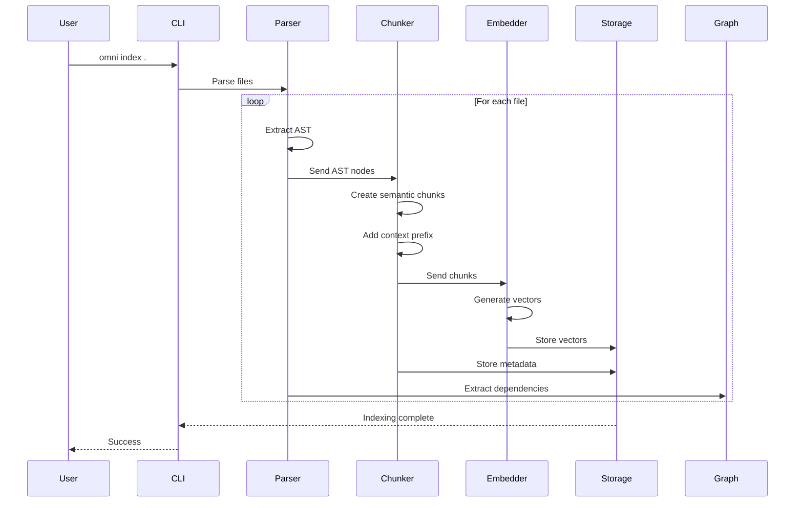

### Search Pipeline

The search pipeline combines multiple retrieval strategies for optimal results.

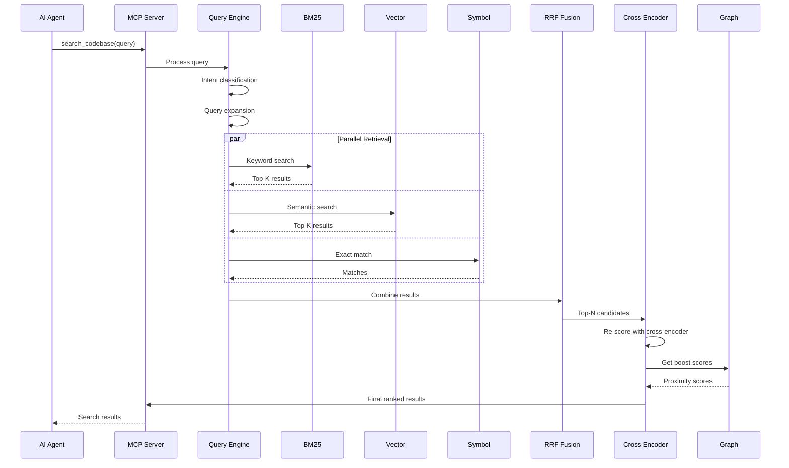

## Component Architecture

### 1. Parser & Chunker

Extracts AST structure and creates semantic chunks with context.

```mermaid
graph LR
    subgraph Parser
        File[Source File] --> TS[tree-sitter]
        TS --> AST[AST Nodes]
    end
    
    subgraph Chunker
        AST --> Extract[Extract Symbols]
        Extract --> Context[Add Context]
        Context --> Enrich[Enrich Metadata]
    end
    
    subgraph Output
        Enrich --> Chunks[Semantic Chunks]
        Chunks --> Meta[Metadata < 2KB]
    end
    
    style Parser fill:#1f2937
    style Chunker fill:#1f2937
    style Output fill:#1f2937
```

**Supported Languages**: Python, TypeScript, JavaScript, Rust, Go, Java, C/C++, C#, Ruby, PHP, Swift, Kotlin, CSS

**Chunk Structure**:
- Symbol path (e.g., `module::class::method`)
- Code content with syntax
- Context prefix (file/class context)
- Line numbers and file path
- Metadata (< 2KB per chunk)

### 2. Embedding System

Generates vector embeddings using local ONNX models.

```mermaid
graph TB
    subgraph Input
        Chunks[Semantic Chunks]
    end
    
    subgraph Embedder
        Batch[Dynamic Batching]
        Model[jina-v2-base-code<br/>ONNX Runtime]
        Quant[INT8 Quantization]
    end
    
    subgraph Output
        Vectors[768-dim Vectors]
        Storage[Vector Storage]
    end
    
    Chunks --> Batch
    Batch --> Model
    Model --> Quant
    Quant --> Vectors
    Vectors --> Storage
    
    style Input fill:#1f2937
    style Embedder fill:#1f2937
    style Output fill:#1f2937
```

**Performance**:
- Model: jina-embeddings-v2-base-code (550MB)
- Throughput: >800 chunks/sec on CPU
- Dimensions: 768
- Quantization: INT8 (4x memory reduction)
- Batch size: Dynamic (16-128)

### 3. Search Engine

Hybrid retrieval combining keyword, semantic, and symbol search.

```mermaid
graph TB
    subgraph Query Processing
        Q[Query] --> Intent[Intent Classification]
        Intent --> Expand[Query Expansion]
        Expand --> Syn[Synonym Addition]
        Expand --> HyDE[HyDE Generation]
    end
    
    subgraph Retrieval
        Syn --> K[BM25 Keyword]
        HyDE --> V[HNSW Vector]
        Q --> S[Symbol Exact]
    end
    
    subgraph Fusion
        K --> RRF[RRF Fusion]
        V --> RRF
        S --> RRF
        RRF --> Top[Top-K Candidates]
    end
    
    subgraph Reranking
        Top --> CE[Cross-Encoder]
        CE --> GB[Graph Boost]
        GB --> Final[Final Results]
    end
    
    style Query fill:#1f2937
    style Retrieval fill:#1f2937
    style Fusion fill:#1f2937
    style Reranking fill:#1f2937
```

**Search Stages**:

1. **Intent Classification**: Architectural / Implementation / Debugging
2. **Query Expansion**: Synonyms + HyDE (Hypothetical Document Embeddings)
3. **Multi-Signal Retrieval**: BM25 + Vector + Symbol
4. **RRF Fusion**: Reciprocal Rank Fusion with adaptive weights
5. **Cross-Encoder Reranking**: jina-reranker-v2-base-multilingual
6. **Graph Boosting**: Dependency proximity scoring

### 4. Dependency Graph

Tracks relationships between code elements for architectural understanding.

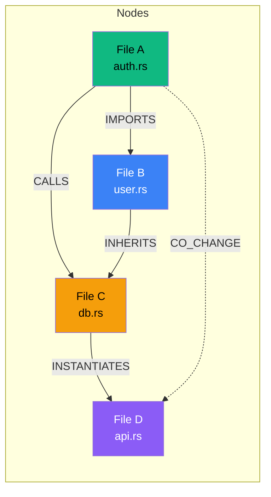

**Edge Types**:
- **IMPORTS**: Module/package imports
- **INHERITS**: Class inheritance
- **CALLS**: Function calls
- **INSTANTIATES**: Object creation
- **HISTORICAL_CO_CHANGE**: Files changed together in commits

**Operations**:
- N-hop traversal (<10ms for 1-hop)
- PageRank scoring
- Community detection
- Proximity boosting

## Storage Architecture

### Database Schema

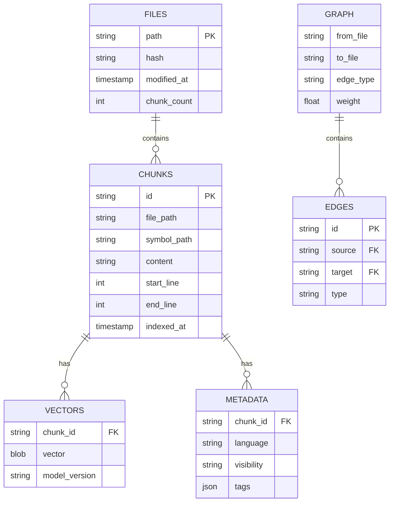

### Index Structure

```mermaid
graph TB
    subgraph SQLite
        FTS5[FTS5 Full-Text Index]
        Meta[Metadata Tables]
        Graph[Graph Tables]
    end
    
    subgraph HNSW
        L0[Layer 0<br/>All vectors]
        L1[Layer 1<br/>Skip connections]
        L2[Layer 2<br/>Long jumps]
    end
    
    subgraph Memory
        Cache[LRU Cache]
        Pool[Connection Pool]
    end
    
    FTS5 --> Cache
    Meta --> Cache
    L0 --> Cache
    Cache --> Pool
    
    style SQLite fill:#1f2937
    style HNSW fill:#1f2937
    style Memory fill:#1f2937
```

## Performance Characteristics

### Latency Breakdown

```mermaid
gantt
    title Search Query Latency (P99 < 50ms)
    dateFormat X
    axisFormat %L ms
    
    section Query
    Intent Classification: 0, 2
    Query Expansion: 2, 5
    
    section Retrieval
    BM25 Keyword: 5, 10
    Vector Search: 5, 15
    Symbol Match: 5, 8
    
    section Fusion
    RRF Fusion: 15, 20
    
    section Reranking
    Cross-Encoder: 20, 40
    Graph Boost: 40, 45
    
    section Response
    Format Results: 45, 48
```

### Scalability

| Index Size | Search P99 | Memory | Throughput |
|------------|-----------|--------|------------|
| 10K chunks | <50ms | 200MB | 1000 qps |
| 100K chunks | <50ms | 1.5GB | 800 qps |
| 1M chunks | <75ms | 12GB | 500 qps |
| 10M chunks | <100ms | 100GB | 200 qps |

## Technology Stack

```mermaid
graph TB
    subgraph Languages
        Rust[Rust<br/>Core Engine]
        TS[TypeScript<br/>VS Code Extension]
    end
    
    subgraph Parsing
        TreeSitter[tree-sitter<br/>16+ languages]
    end
    
    subgraph ML
        ONNX[ONNX Runtime<br/>Embeddings]
        Jina[jina-v2-base-code<br/>550MB model]
    end
    
    subgraph Storage
        SQLite[SQLite<br/>FTS5 + Metadata]
        HNSWLib[HNSW<br/>Vector Index]
    end
    
    subgraph Protocol
        MCP[Model Context Protocol<br/>AI Agent Integration]
    end
    
    Rust --> TreeSitter
    Rust --> ONNX
    Rust --> SQLite
    Rust --> HNSWLib
    Rust --> MCP
    ONNX --> Jina
    
    style Languages fill:#1f2937
    style Parsing fill:#1f2937
    style ML fill:#1f2937
    style Storage fill:#1f2937
    style Protocol fill:#1f2937
```

## Deployment Architecture

### Standalone Mode

```mermaid
graph TB
    subgraph User Machine
        CLI[omni-cli]
        Daemon[omni-daemon]
        MCP[omni-mcp]
        Core[omni-core]
        
        CLI --> Core
        Daemon --> Core
        MCP --> Core
    end
    
    subgraph Storage
        Index[.omnicontext/<br/>index.db]
        Models[~/.omnicontext/<br/>models/]
    end
    
    Core --> Index
    Core --> Models
    
    subgraph AI Clients
        Claude[Claude Desktop]
        Cursor[Cursor]
        Kiro[Kiro]
    end
    
    Claude --> MCP
    Cursor --> MCP
    Kiro --> MCP
    
    style User fill:#1f2937
    style Storage fill:#1f2937
    style AI fill:#1f2937
```

### Enterprise Mode

```mermaid
graph TB
    subgraph Load Balancer
        LB[nginx/HAProxy]
    end
    
    subgraph API Servers
        API1[omni-server 1]
        API2[omni-server 2]
        API3[omni-server 3]
    end
    
    subgraph Storage Layer
        PG[(PostgreSQL<br/>Metadata)]
        S3[(S3/MinIO<br/>Vectors)]
        Redis[(Redis<br/>Cache)]
    end
    
    subgraph Clients
        Web[Web UI]
        IDE[IDE Plugins]
        API[API Clients]
    end
    
    Web --> LB
    IDE --> LB
    API --> LB
    
    LB --> API1
    LB --> API2
    LB --> API3
    
    API1 --> PG
    API1 --> S3
    API1 --> Redis
    
    API2 --> PG
    API2 --> S3
    API2 --> Redis
    
    API3 --> PG
    API3 --> S3
    API3 --> Redis
    
    style Load fill:#1f2937
    style API fill:#1f2937
    style Storage fill:#1f2937
    style Clients fill:#1f2937
```

## Competitive Advantages

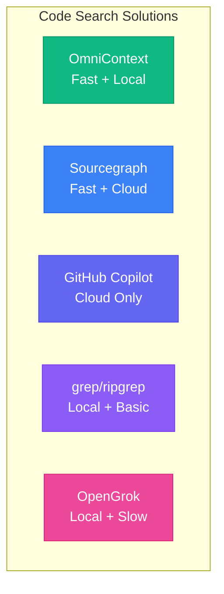

**Key Differentiators**:
- ✅ 100% Local execution (zero data leakage)
- ✅ Sub-100ms queries (no network latency)
- ✅ Graph-aware ranking (architectural understanding)
- ✅ Open source (full transparency)
- ✅ MCP native (AI agent integration)

## Research Foundation

| Technique | Paper | Application |
|-----------|-------|-------------|
| RAPTOR | arXiv:2401.18059 (2024) | Hierarchical chunking |
| Late Chunking | arXiv:2409.04701 (2024) | Context preservation |
| Contextual Retrieval | Anthropic (2024) | Chunk enrichment |
| HyDE | arXiv:2212.10496 (2022) | Query expansion |
| HNSW | arXiv:1603.09320 (2018) | Vector indexing |
| RRF | Cormack SIGIR (2009) | Result fusion |
| MS MARCO | Microsoft (2021) | Cross-encoder reranking |
