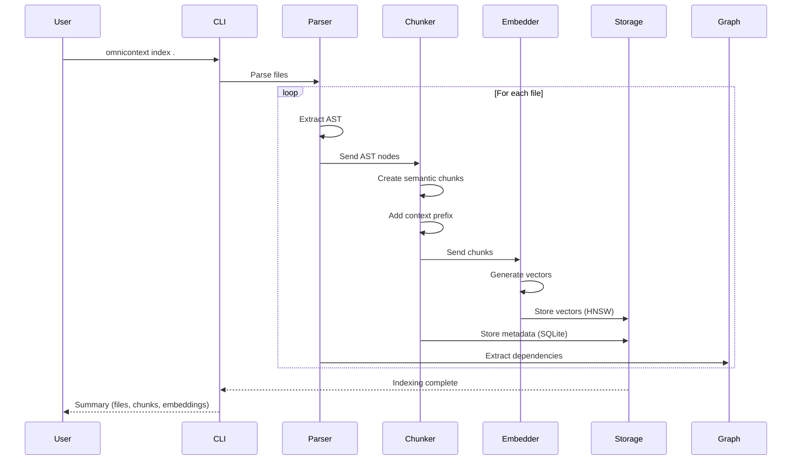
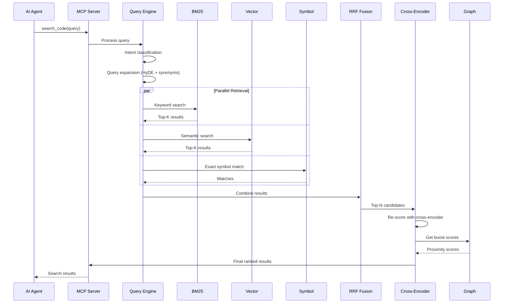
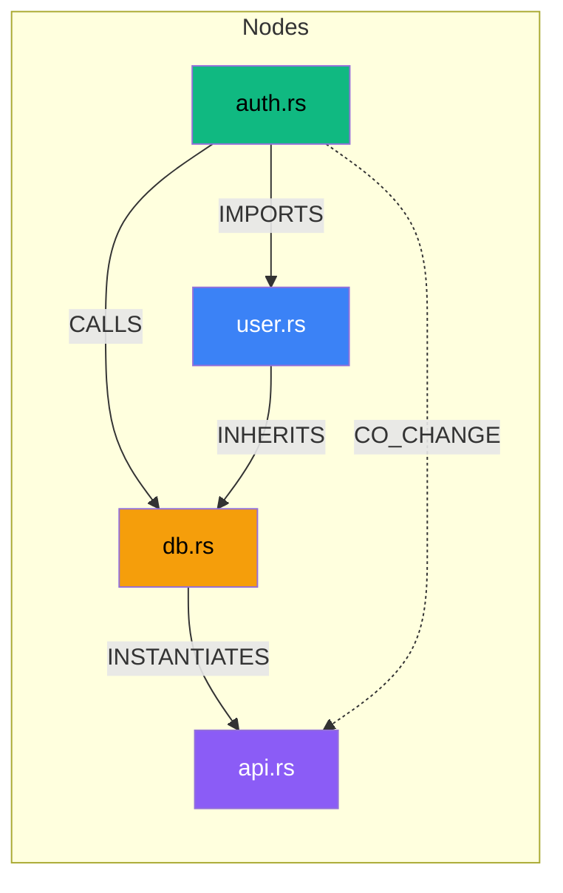
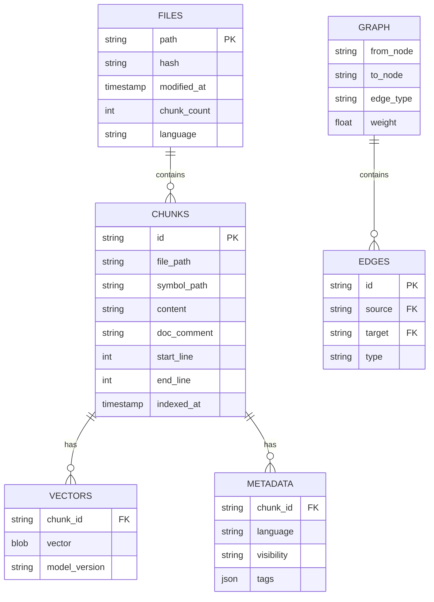

# Architecture

OmniContext combines syntactic analysis, vector embeddings, dependency graph reasoning, and a universal IDE orchestrator to deliver fast, accurate semantic code search — entirely on your local machine.

---

## System Overview

The system consists of five main components working together:

```mermaid
graph TB
    subgraph Input["Input Layer"]
        Files[Source Files]
        Query[Search Query]
    end

    subgraph Processing["Processing Layer"]
        Parser[Tree-sitter Parser]
        Chunker[Semantic Chunker]
        Embedder[ONNX Embedder]
        QE[Query Engine]
        Orch[Orchestrator]
    end

    subgraph Storage["Storage Layer"]
        SQLite[(SQLite FTS5)]
        HNSW[(HNSW Index)]
        Graph[(Dependency Graph)]
    end

    subgraph Search["Search Layer"]
        BM25[BM25 Keyword]
        Vector[Vector Search]
        Symbol[Symbol Match]
        RRF[RRF Fusion]
        Rerank[Cross-Encoder]
        GraphBoost[Graph Boost]
    end

    Files --> Parser
    Parser --> Chunker
    Chunker --> Embedder
    Embedder --> HNSW
    Chunker --> SQLite
    Parser --> Graph

    Query --> QE
    QE --> BM25
    QE --> Vector
    QE --> Symbol

    SQLite --> BM25
    HNSW --> Vector
    Graph --> Symbol

    BM25 --> RRF
    Vector --> RRF
    Symbol --> RRF

    RRF --> Rerank
    Rerank --> GraphBoost
    Graph --> GraphBoost
    GraphBoost --> Results[Search Results]

    Orch -->|Auto-configures| IDE[AI IDEs & Agents]

    style Input fill:#1a1a1f
    style Processing fill:#1a1a1f
    style Storage fill:#1a1a1f
    style Search fill:#1a1a1f
    style Results fill:#10b981,color:#000
    style IDE fill:#3b82f6,color:#fff
```



---

## Data Flow Architecture

### Indexing Pipeline

The indexing pipeline processes source files through multiple stages to build searchable indexes.



### Search Pipeline

The search pipeline combines multiple retrieval strategies for optimal results.



---

## Component Architecture

### 1. Parser and Chunker

Extracts AST structure and creates semantic chunks with full context.

```mermaid
graph LR
    subgraph Parser
        File[Source File] --> TS[tree-sitter]
        TS --> AST[AST Nodes]
    end

    subgraph Chunker
        AST --> Extract[Extract Symbols]
        Extract --> Context[Add Context Prefix]
        Context --> Enrich[Enrich Metadata]
    end

    subgraph Output
        Enrich --> Chunks[Semantic Chunks]
        Chunks --> Meta[Metadata < 2 KB]
    end

    style Parser fill:#1f2937
    style Chunker fill:#1f2937
    style Output fill:#1f2937
```



**Supported Languages**: Python, TypeScript, JavaScript, Rust, Go, Java, C, C++, C#, Ruby, PHP, Swift, Kotlin, CSS

**Chunk Structure**:
- Symbol path (e.g., `module::class::method`)
- Code content with full syntax
- Context prefix (parent file and class context)
- Line numbers and file path
- Doc comment (extracted for search)
- Metadata (< 2 KB per chunk)

---

### 2. Embedding System

Generates vector embeddings using a local ONNX model — no external API calls.

```mermaid
graph TB
    subgraph Input
        Chunks[Semantic Chunks]
    end

    subgraph Embedder
        Batch[Dynamic Batching]
        Model[jina-embeddings-v2-base-code<br/>ONNX Runtime]
        Quant[INT8 Quantization]
    end

    subgraph Output
        Vectors[768-dim Vectors]
        Storage[HNSW Vector Index]
    end

    Chunks --> Batch
    Batch --> Model
    Model --> Quant
    Quant --> Vectors
    Vectors --> Storage

    style Input fill:#1f2937
    style Embedder fill:#1f2937
    style Output fill:#1f2937
```



**Specifications**:
- **Model**: Jina embeddings v2 base code (`jina-embeddings-v2-base-code`)
- **Format**: ONNX (~550 MB, downloaded once to `~/.omnicontext/models/`)
- **Dimensions**: 768
- **Throughput**: > 800 chunks / second on CPU
- **Quantization**: INT8 (4× memory reduction when enabled)
- **Batch size**: Dynamic (16–128)

---

### 3. Search Engine

Hybrid retrieval combining keyword, semantic, and symbol search with graph-boosted reranking.

```mermaid
graph TB
    subgraph "Query Processing"
        Q[Query] --> Intent[Intent Classification]
        Intent --> Expand[Query Expansion]
        Expand --> Syn[Synonym Addition]
        Expand --> HyDE[HyDE Generation]
    end

    subgraph "Retrieval"
        Syn --> K[BM25 Keyword]
        HyDE --> V[HNSW Vector]
        Q --> S[Symbol Exact]
    end

    subgraph "Fusion"
        K --> RRF[RRF Fusion]
        V --> RRF
        S --> RRF
        RRF --> Top[Top-K Candidates]
    end

    subgraph "Reranking"
        Top --> CE[Cross-Encoder]
        CE --> GB[Graph Boost]
        GB --> Final[Final Results]
    end

    style "Query Processing" fill:#1f2937
    style "Retrieval" fill:#1f2937
    style "Fusion" fill:#1f2937
    style "Reranking" fill:#1f2937
```

**Search Stages**:

1. **Intent Classification**: Architectural / Implementation / Debugging / Refactor
2. **Query Expansion**: Synonyms + HyDE (Hypothetical Document Embeddings)
3. **Multi-Signal Retrieval**: BM25 + HNSW Vector + Symbol exact match (in parallel)
4. **RRF Fusion**: Reciprocal Rank Fusion with adaptive weights
5. **Cross-Encoder Reranking**: `jina-reranker-v2-base-multilingual`
6. **Graph Boosting**: Dependency proximity scoring

---

### 4. Dependency Graph

Tracks relationships between code elements for architectural understanding and blast radius analysis.



**Edge Types**:
| Type | Meaning |
|------|---------|
| `IMPORTS` | Module or package import |
| `INHERITS` | Class inheritance |
| `CALLS` | Function call relationship |
| `INSTANTIATES` | Object instantiation |
| `HISTORICAL_CO_CHANGE` | Files changed together in git commits |

**Operations**:
- N-hop BFS traversal (< 10 ms for 1-hop on 10 K+ nodes)
- PageRank importance scoring
- Community detection
- Blast radius analysis
- Proximity boosting for search reranking

---

### 5. Orchestrator Module

The **Orchestrator** (`crates/omni-cli/src/orchestrator.rs`) auto-discovers every AI IDE and agent installed on the host and injects a single universal MCP server entry using `--repo .`.

```mermaid
graph TB
    subgraph "omnicontext setup --all"
        Orch[Orchestrator]
    end

    subgraph "Detected IDEs"
        CD[Claude Desktop]
        CC[Claude Code]
        CU[Cursor]
        WS[Windsurf]
        VS[VS Code]
        CL[Cline]
        RC[RooCode]
        CO[Continue.dev]
        ZD[Zed]
        KI[Kiro]
        PA[PearAI]
        TR[Trae]
        GC[Gemini CLI]
        AQ[Amazon Q CLI]
        AU[Augment Code]
    end

    Orch -->|Injects universal entry| CD
    Orch -->|Injects universal entry| CC
    Orch -->|Injects universal entry| CU
    Orch -->|Injects universal entry| WS
    Orch -->|Injects universal entry| VS
    Orch -->|Injects universal entry| CL
    Orch -->|Injects universal entry| RC
    Orch -->|Injects universal entry| CO
    Orch -->|Injects universal entry| ZD
    Orch -->|Injects universal entry| KI
    Orch -->|Injects universal entry| PA
    Orch -->|Injects universal entry| TR
    Orch -->|Injects universal entry| GC
    Orch -->|Injects universal entry| AQ
    Orch -->|Injects universal entry| AU
```



**Design principles**:
- **Universal entry**: always keyed `"omnicontext"` — never project-specific hash variants.
- **`--repo .` standard**: the MCP server is started with `--repo .` so it resolves the workspace dynamically from the IDE's working directory or `OMNICONTEXT_REPO` env var.
- **Atomic JSON patching**: existing IDE config files are never overwritten wholesale; only the `"omnicontext"` key inside the MCP servers map is inserted or updated.
- **Legacy purge**: any `omnicontext-<hex>` duplicate entries from older versions are removed automatically.
- **Idempotent**: running `omnicontext setup --all` multiple times is safe — it is a no-op when the entry is already current.
- **Self-repair**: the orchestrator performs a silent health check on each `omnicontext` invocation and re-injects any entries that were lost due to an IDE update overwriting its config.

---

## Storage Architecture

### Database Schema



### Index Structure

```mermaid
graph TB
    subgraph SQLite
        FTS5[FTS5 Full-Text Index]
        Meta[Metadata Tables]
        GraphTbl[Graph Tables]
        CommitTbl[Commit History Tables]
    end

    subgraph HNSW
        L0[Layer 0 — All vectors]
        L1[Layer 1 — Skip connections]
        L2[Layer 2 — Long jumps]
    end

    subgraph Memory
        Cache[LRU Cache]
        Pool[Connection Pool]
    end

    FTS5 --> Cache
    Meta --> Cache
    L0 --> Cache
    Cache --> Pool

    style SQLite fill:#1f2937
    style HNSW fill:#1f2937
    style Memory fill:#1f2937
```



---

## Performance Characteristics

### Search Latency Breakdown (P99 target: < 50 ms)


### Scalability

| Index Size | Search P99 | Memory | Throughput |
|------------|-----------|--------|------------|
| 10 K chunks | < 50 ms | 200 MB | 1 000 qps |
| 100 K chunks | < 50 ms | 1.5 GB | 800 qps |
| 1 M chunks | < 75 ms | 12 GB | 500 qps |
| 10 M chunks | < 100 ms | 100 GB | 200 qps |

---

## Technology Stack

```mermaid
graph TB
    subgraph Languages
        Rust[Rust — Core Engine]
        TS[TypeScript — VS Code Extension]
    end

    subgraph Parsing
        TreeSitter[tree-sitter — 13+ languages]
    end

    subgraph ML
        ONNX[ONNX Runtime — Embeddings]
        Jina[jina-embeddings-v2-base-code<br/>550 MB model]
    end

    subgraph Storage
        SQLite[SQLite — FTS5 + Metadata + Graph]
        HNSWLib[HNSW — Vector Index]
    end

    subgraph Protocol
        MCP[Model Context Protocol — AI Agent Integration]
    end

    Rust --> TreeSitter
    Rust --> ONNX
    Rust --> SQLite
    Rust --> HNSWLib
    Rust --> MCP
    ONNX --> Jina

    style Languages fill:#1f2937
    style Parsing fill:#1f2937
    style ML fill:#1f2937
    style Storage fill:#1f2937
    style Protocol fill:#1f2937
```



---

## Deployment Architecture

### Standalone Mode (Default)

```mermaid
graph TB
    subgraph "User Machine"
        CLI[omnicontext CLI]
        Daemon[omnicontext-daemon]
        MCPSrv[omnicontext-mcp]
        Core[omni-core library]

        CLI --> Core
        Daemon --> Core
        MCPSrv --> Core
    end

    subgraph "Per-Repo Storage"
        Index[".omnicontext/index.db"]
    end

    subgraph "Global Cache"
        Models["~/.omnicontext/models/"]
    end

    Core --> Index
    Core --> Models

    subgraph "AI Clients"
        ClaudeD[Claude Desktop]
        ClaudeC[Claude Code]
        CursorI[Cursor]
        WindsurfI[Windsurf]
        VSCodeI[VS Code]
    end

    ClaudeD --> MCPSrv
    ClaudeC --> MCPSrv
    CursorI --> MCPSrv
    WindsurfI --> MCPSrv
    VSCodeI --> MCPSrv

    style "User Machine" fill:#1f2937
    style "Per-Repo Storage" fill:#1f2937
    style "Global Cache" fill:#1f2937
    style "AI Clients" fill:#1f2937
```

**Binary names**:
| Binary | Role |
|--------|------|
| `omnicontext` | Primary CLI (index, search, config, setup, mcp subcommand) |
| `omnicontext-mcp` | Dedicated MCP server binary (stdio transport) |
| `omnicontext-daemon` | Background file-watcher daemon for incremental re-indexing |

---

## Key Differentiators

| Capability | OmniContext | Sourcegraph | GitHub Copilot | ripgrep |
|-----------|-------------|-------------|----------------|---------|
| 100% local | ✅ | ❌ (cloud) | ❌ (cloud) | ✅ |
| Semantic search | ✅ | ✅ | ✅ | ❌ |
| Graph-aware ranking | ✅ | Partial | ❌ | ❌ |
| MCP native | ✅ | ❌ | ❌ | ❌ |
| Sub-50 ms queries | ✅ | Varies | Varies | ✅ |
| Open source | ✅ (Apache 2.0) | Partial | ❌ | ✅ |

---

## Research Foundation

| Technique | Reference | Application in OmniContext |
|-----------|-----------|---------------------------|
| RAPTOR | arXiv:2401.18059 (2024) | Hierarchical chunking |
| Late Chunking | arXiv:2409.04701 (2024) | Context-preserving chunk boundaries |
| Contextual Retrieval | Anthropic (2024) | Chunk enrichment with context prefixes |
| HyDE | arXiv:2212.10496 (2022) | Query expansion via hypothetical documents |
| HNSW | arXiv:1603.09320 (2018) | Approximate nearest-neighbor vector indexing |
| RRF | Cormack SIGIR (2009) | Multi-signal result fusion |
| MS MARCO | Microsoft (2021) | Cross-encoder reranking training data |
